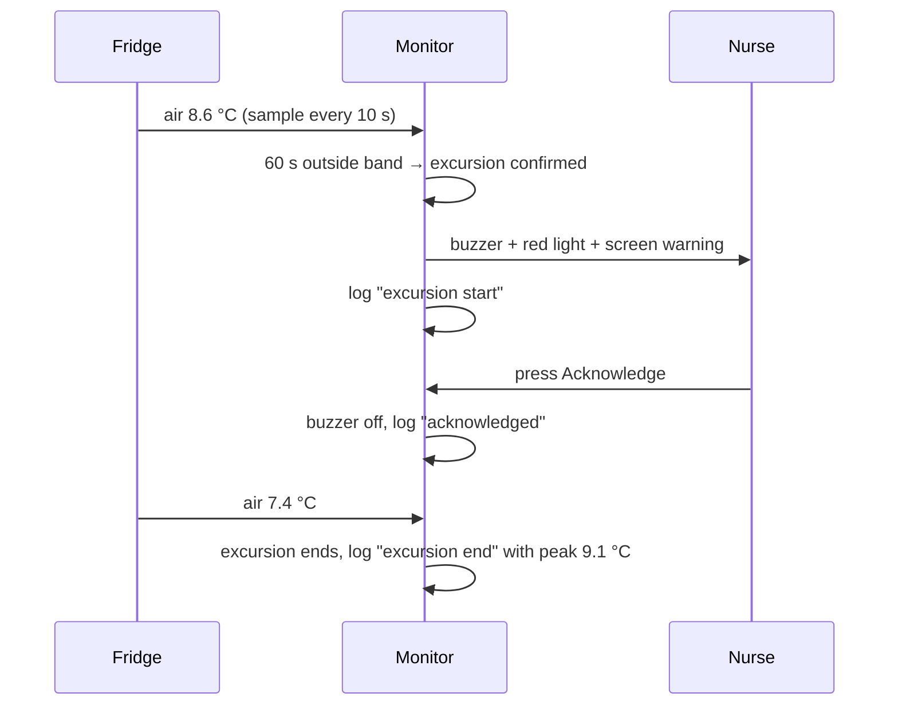
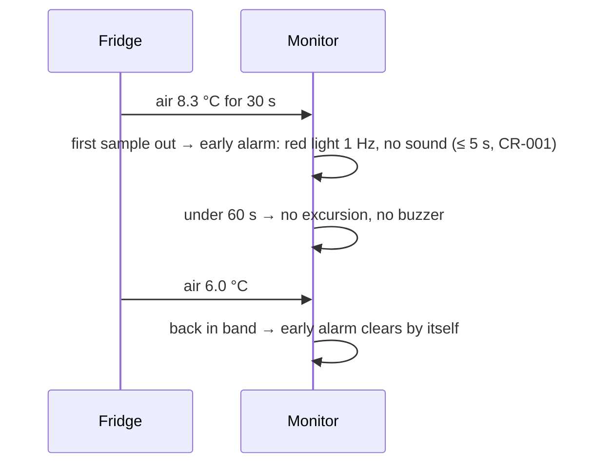
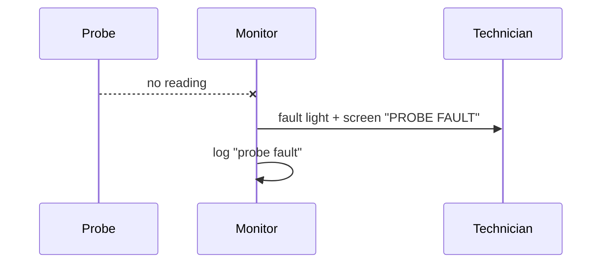
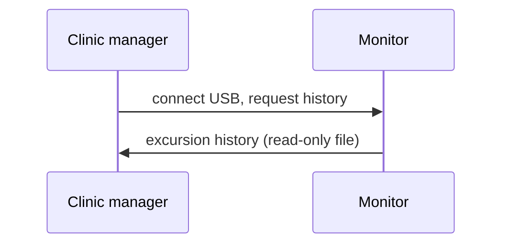

# Operational scenarios — MRTM

> **MANUAL** (F-12). Mermaid is allowed here only for scenario sequences (PROMPT rule 6). The formal sequences are SysML in Phase 7.

## SC-1 — Fridge warms up at night

## SC-2 — Door opened for 30 seconds

## SC-3 — Probe unplugged

## SC-4 — Audit readout

