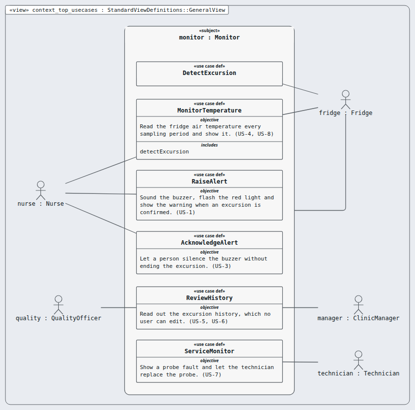

# Node `context` — context

> MODEL-LEVELS · generated by `tools/levels-build.py index` from `.ejadah/rew/framework.yaml` · DRAFT — needs Masood's review

| | |
|---|---|
| Kind | context (ISO 14971 cl. 5.2 intended use) |
| Role | top — the people's needs |
| IEC 62304 class | **C** — reason in each requirement's `## Safety` section and ADR-0034 |
| Parent | — |
| Children | [`system`](mrtm/INDEX.md) |
| Units (bottom) | — |

## Pictures, in reading order

1. **`context_top_usecases`** — who uses the monitor and for what

   

## Requirements this node satisfies (8) — and nothing else

| Id | Title | Derived from (parent node) | Class |
|---|---|---|---|
| [MRTM-STK-001](../../03-requirements/stakeholder/MRTM-STK-001.md) | Alert on excursion | [] | C |
| [MRTM-STK-002](../../03-requirements/stakeholder/MRTM-STK-002.md) | No alert on brief door opening | [] | C |
| [MRTM-STK-003](../../03-requirements/stakeholder/MRTM-STK-003.md) | Silence the alert | [] | C |
| [MRTM-STK-004](../../03-requirements/stakeholder/MRTM-STK-004.md) | See the temperature | [] | C |
| [MRTM-STK-005](../../03-requirements/stakeholder/MRTM-STK-005.md) | Audit history | [] | C |
| [MRTM-STK-006](../../03-requirements/stakeholder/MRTM-STK-006.md) | History cannot be edited | [] | C |
| [MRTM-STK-007](../../03-requirements/stakeholder/MRTM-STK-007.md) | Probe failure is visible | [] | C |
| [MRTM-STK-008](../../03-requirements/stakeholder/MRTM-STK-008.md) | Monitoring through a power cut | [] | C |

## Model files

`NodeContext.sysml`
