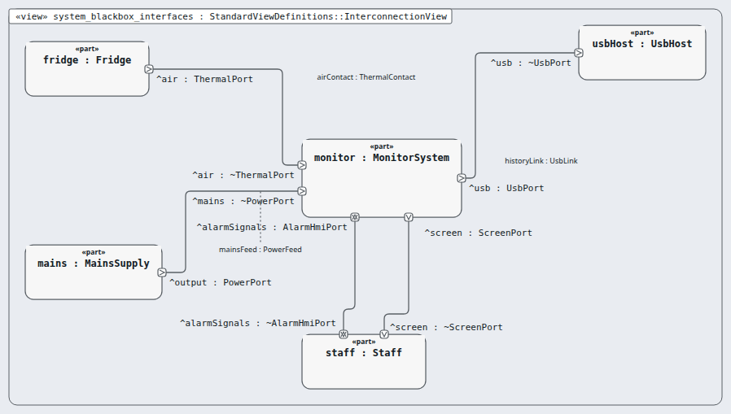
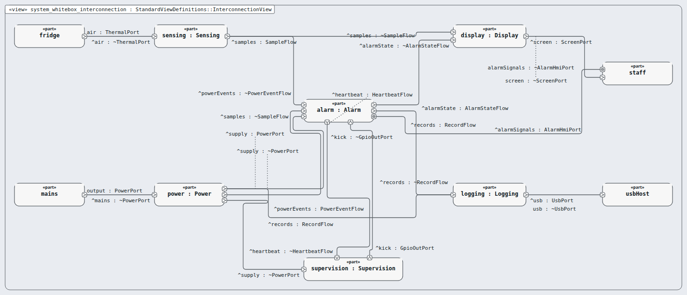
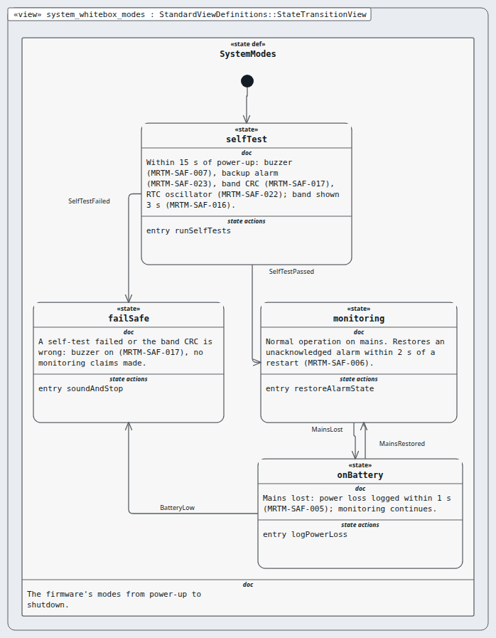
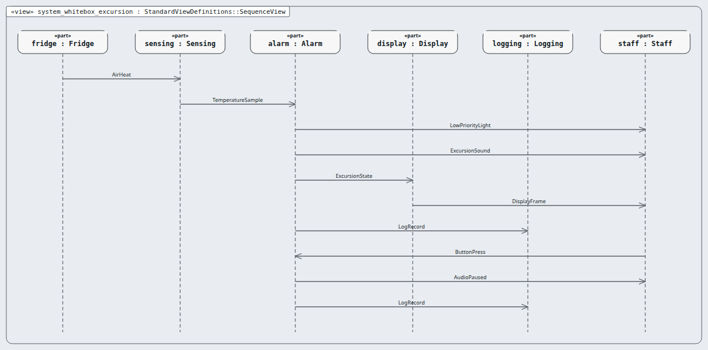
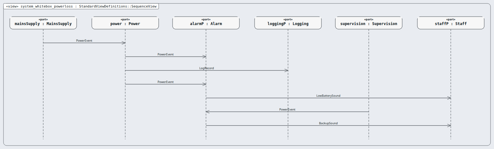
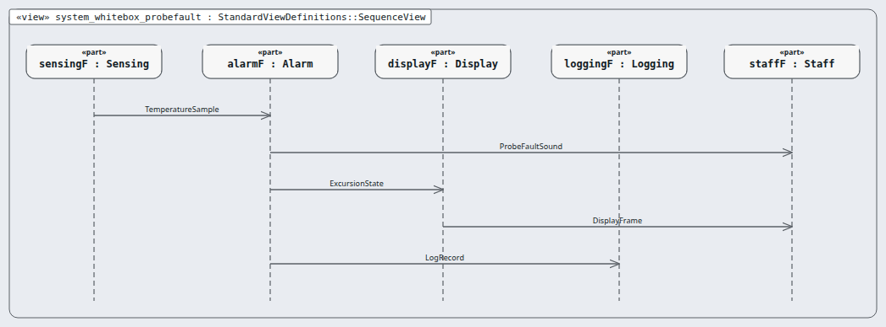

# Node `system` — system

> MODEL-LEVELS · generated by `tools/levels-build.py index` from `.ejadah/rew/framework.yaml` · DRAFT — needs Masood's review

| | |
|---|---|
| Kind | system (IEC 60601-1 cl. 14 PEMS; IEC 62304 software system) |
| Role | black box, then white box (the MagicGrid step) |
| IEC 62304 class | **C** — reason in each requirement's `## Safety` section and ADR-0034 |
| Parent | `context` → [INDEX](../context/INDEX.md) |
| Children | [`sensing`](sensing/INDEX.md), [`alarm`](alarm/INDEX.md), [`display`](display/INDEX.md), [`logging`](logging/INDEX.md), [`power`](power/INDEX.md), [`supervision`](supervision/INDEX.md) |
| Units (bottom) | — |

## Pictures, in reading order

1. **`system_blackbox_interfaces`** — the node as ONE box, with the neighbours it is wired to (its promises face outward)

   

2. **`system_whitebox_interconnection`** — inside the node: its parts and their wires, and where the wires leave the node

   

3. **`system_whitebox_modes`** — the modes the monitor moves through

   

4. **`system_whitebox_excursion`** — scenario: warm air to alarm, subsystem by subsystem

   

5. **`system_whitebox_powerloss`** — scenario: mains lost, battery, backup alarm

   

6. **`system_whitebox_probefault`** — scenario: the probe stops giving good samples

   

## Requirements this node satisfies (62) — and nothing else

| Id | Title | Derived from (parent node) | Class |
|---|---|---|---|
| [MRTM-ENV-001](../../03-requirements/environmental/MRTM-ENV-001.md) | Battery endurance | ["MRTM-SYS-016"] | C |
| [MRTM-ENV-002](../../03-requirements/environmental/MRTM-ENV-002.md) | Ambient temperature | ["MRTM-SYS-001"] | C |
| [MRTM-ENV-003](../../03-requirements/environmental/MRTM-ENV-003.md) | Humidity | ["MRTM-SYS-001"] | C |
| [MRTM-ENV-004](../../03-requirements/environmental/MRTM-ENV-004.md) | Probe environment | ["MRTM-SYS-001"] | C |
| [MRTM-IFC-001](../../03-requirements/interface/MRTM-IFC-001.md) | Probe bus | ["MRTM-SYS-001"] | C |
| [MRTM-IFC-002](../../03-requirements/interface/MRTM-IFC-002.md) | Acknowledge input | ["MRTM-SYS-006"] | C |
| [MRTM-IFC-003](../../03-requirements/interface/MRTM-IFC-003.md) | USB readout | ["MRTM-SYS-014"] | C |
| [MRTM-IFC-004](../../03-requirements/interface/MRTM-IFC-004.md) | Display character height | ["MRTM-SYS-005"] | C |
| [MRTM-MNT-001](../../03-requirements/maintainability/MRTM-MNT-001.md) | Probe replacement | ["MRTM-SYS-012"] | C |
| [MRTM-MNT-002](../../03-requirements/maintainability/MRTM-MNT-002.md) | Battery level | ["MRTM-SYS-016"] | C |
| [MRTM-MNT-003](../../03-requirements/maintainability/MRTM-MNT-003.md) | Firmware version | ["MRTM-SYS-001"] | C |
| [MRTM-PRF-001](../../03-requirements/performance/MRTM-PRF-001.md) | Measurement accuracy | ["MRTM-SYS-001"] | C |
| [MRTM-PRF-002](../../03-requirements/performance/MRTM-PRF-002.md) | End-to-end alert time | ["MRTM-SYS-003"] | C |
| [MRTM-PRF-003](../../03-requirements/performance/MRTM-PRF-003.md) | Log readout time | ["MRTM-SYS-015"] | C |
| [MRTM-PRF-004](../../03-requirements/performance/MRTM-PRF-004.md) | Display refresh | ["MRTM-SYS-011"] | C |
| [MRTM-SAF-001](../../03-requirements/safety/MRTM-SAF-001.md) | Buzzer loudness | ["MRTM-SYS-003"] | C |
| [MRTM-SAF-002](../../03-requirements/safety/MRTM-SAF-002.md) | Probe fault raises alert | ["MRTM-SYS-012"] | C |
| [MRTM-SAF-003](../../03-requirements/safety/MRTM-SAF-003.md) | Implausible sample | ["MRTM-SYS-001"] | C |
| [MRTM-SAF-004](../../03-requirements/safety/MRTM-SAF-004.md) | Watchdog restart | ["MRTM-SYS-001"] | C |
| [MRTM-SAF-005](../../03-requirements/safety/MRTM-SAF-005.md) | Log power loss | ["MRTM-SYS-016"] | C |
| [MRTM-SAF-006](../../03-requirements/safety/MRTM-SAF-006.md) | Alert survives restart | ["MRTM-SYS-003"] | C |
| [MRTM-SAF-007](../../03-requirements/safety/MRTM-SAF-007.md) | Buzzer self-test | ["MRTM-SYS-003"] | C |
| [MRTM-SAF-008](../../03-requirements/safety/MRTM-SAF-008.md) | Low battery alarm | ["MRTM-SYS-016"] | C |
| [MRTM-SAF-009](../../03-requirements/safety/MRTM-SAF-009.md) | Backup alarm on firmware silence | ["MRTM-SYS-003"] | C |
| [MRTM-SAF-010](../../03-requirements/safety/MRTM-SAF-010.md) | Watchdog tied to the alarm service | ["MRTM-SYS-003"] | C |
| [MRTM-SAF-011](../../03-requirements/safety/MRTM-SAF-011.md) | Fault tone differs from excursion tone | ["MRTM-SYS-012"] | C |
| [MRTM-SAF-012](../../03-requirements/safety/MRTM-SAF-012.md) | Probe calibration due | ["MRTM-SYS-001"] | C |
| [MRTM-SAF-013](../../03-requirements/safety/MRTM-SAF-013.md) | Alarm on total power loss | ["MRTM-SYS-016"] | C |
| [MRTM-SAF-014](../../03-requirements/safety/MRTM-SAF-014.md) | Buzzer open-circuit detection | ["MRTM-SYS-003"] | C |
| [MRTM-SAF-015](../../03-requirements/safety/MRTM-SAF-015.md) | Diverse signal for buzzer fault | ["MRTM-SYS-004"] | C |
| [MRTM-SAF-016](../../03-requirements/safety/MRTM-SAF-016.md) | Show the band at power-up | ["MRTM-SYS-017"] | C |
| [MRTM-SAF-017](../../03-requirements/safety/MRTM-SAF-017.md) | Band integrity check | ["MRTM-SYS-017"] | C |
| [MRTM-SAF-018](../../03-requirements/safety/MRTM-SAF-018.md) | Two copies of every record | ["MRTM-SYS-015"] | C |
| [MRTM-SAF-019](../../03-requirements/safety/MRTM-SAF-019.md) | Stuck acknowledge button | ["MRTM-SYS-006"] | C |
| [MRTM-SAF-020](../../03-requirements/safety/MRTM-SAF-020.md) | Probe placement in the instructions | ["MRTM-SYS-001"] | C |
| [MRTM-SAF-021](../../03-requirements/safety/MRTM-SAF-021.md) | I2C bus recovery | ["MRTM-SYS-005"] | C |
| [MRTM-SAF-022](../../03-requirements/safety/MRTM-SAF-022.md) | Clock stop detection | ["MRTM-SYS-020"] | C |
| [MRTM-SAF-023](../../03-requirements/safety/MRTM-SAF-023.md) | Backup alarm power-up test | ["MRTM-SYS-003"] | C |
| [MRTM-SYS-001](../../03-requirements/system/MRTM-SYS-001.md) | Sampling period | ["MRTM-STK-004"] | C |
| [MRTM-SYS-002](../../03-requirements/system/MRTM-SYS-002.md) | Excursion confirmation | ["MRTM-STK-002"] | C |
| [MRTM-SYS-003](../../03-requirements/system/MRTM-SYS-003.md) | Buzzer on excursion | ["MRTM-STK-001"] | C |
| [MRTM-SYS-004](../../03-requirements/system/MRTM-SYS-004.md) | Red indicator on excursion | ["MRTM-STK-001"] | C |
| [MRTM-SYS-005](../../03-requirements/system/MRTM-SYS-005.md) | Warning on excursion | ["MRTM-STK-001"] | C |
| [MRTM-SYS-006](../../03-requirements/system/MRTM-SYS-006.md) | Acknowledge silences buzzer | ["MRTM-STK-003"] | C |
| [MRTM-SYS-007](../../03-requirements/system/MRTM-SYS-007.md) | Warning stays while excursion is open | ["MRTM-STK-003"] | C |
| [MRTM-SYS-008](../../03-requirements/system/MRTM-SYS-008.md) | Log excursion start | ["MRTM-STK-005"] | C |
| [MRTM-SYS-009](../../03-requirements/system/MRTM-SYS-009.md) | Log excursion end | ["MRTM-STK-005"] | C |
| [MRTM-SYS-010](../../03-requirements/system/MRTM-SYS-010.md) | Log acknowledgement | ["MRTM-STK-005"] | C |
| [MRTM-SYS-011](../../03-requirements/system/MRTM-SYS-011.md) | Display resolution | ["MRTM-STK-004"] | C |
| [MRTM-SYS-012](../../03-requirements/system/MRTM-SYS-012.md) | Probe fault detection | ["MRTM-STK-007"] | C |
| [MRTM-SYS-013](../../03-requirements/system/MRTM-SYS-013.md) | Probe fault message | ["MRTM-STK-007"] | C |
| [MRTM-SYS-014](../../03-requirements/system/MRTM-SYS-014.md) | Read-only event log | ["MRTM-STK-006"] | C |
| [MRTM-SYS-015](../../03-requirements/system/MRTM-SYS-015.md) | Event log capacity | ["MRTM-STK-005"] | C |
| [MRTM-SYS-016](../../03-requirements/system/MRTM-SYS-016.md) | Battery operation | ["MRTM-STK-008"] | C |
| [MRTM-SYS-017](../../03-requirements/system/MRTM-SYS-017.md) | Allowed band | ["MRTM-STK-001"] | C |
| [MRTM-SYS-018](../../03-requirements/system/MRTM-SYS-018.md) | Excursion end confirmation | ["MRTM-STK-002"] | C |
| [MRTM-SYS-019](../../03-requirements/system/MRTM-SYS-019.md) | Alarm comes back after silence | ["MRTM-STK-003"] | C |
| [MRTM-SYS-020](../../03-requirements/system/MRTM-SYS-020.md) | Clock drift | ["MRTM-STK-005"] | C |
| [MRTM-SYS-021](../../03-requirements/system/MRTM-SYS-021.md) | Event log integrity | ["MRTM-STK-006"] | C |
| [MRTM-SYS-022](../../03-requirements/system/MRTM-SYS-022.md) | Log capacity warning | ["MRTM-STK-005"] | C |
| [MRTM-SYS-023](../../03-requirements/system/MRTM-SYS-023.md) | Power restore event | ["MRTM-STK-008"] | C |
| [MRTM-SYS-024](../../03-requirements/system/MRTM-SYS-024.md) | Early excursion alarm | ["MRTM-STK-001"] | C |

## Model files

`NodeMrtm.sysml`, `NodeMrtmWhiteBox.sysml`, `NodePorts.sysml`, `SystemExcursion.sysml`, `SystemPowerLoss.sysml`, `SystemProbeFault.sysml`
