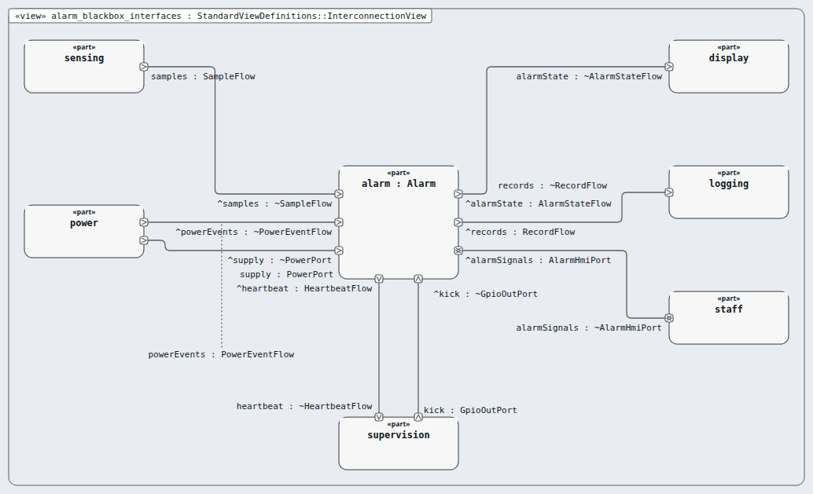
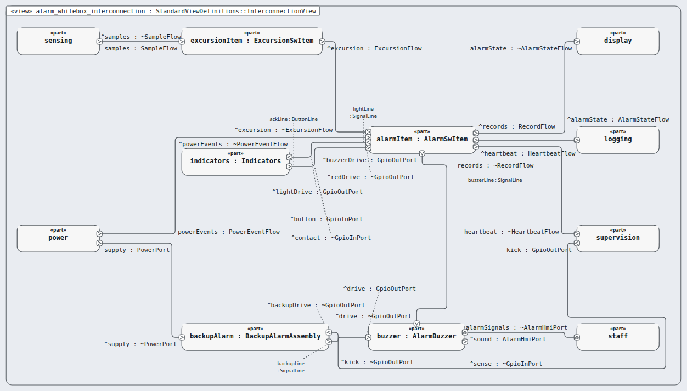

# Node `alarm` — alarm and indication

> MODEL-LEVELS · generated by `tools/levels-build.py index` from `.ejadah/rew/framework.yaml` · DRAFT — needs Masood's review

| | |
|---|---|
| Kind | subsystem (IEC 60601-1 cl. 14.8 PEMS architecture) |
| Role | black box, then white box (the MagicGrid step) |
| IEC 62304 class | **C** — reason in each requirement's `## Safety` section and ADR-0034 |
| Parent | `system` → [INDEX](../INDEX.md) |
| Children | [`excursion-item`](excursion-item/INDEX.md), [`alarm-item`](alarm-item/INDEX.md), [`buzzer`](buzzer/INDEX.md), [`indicators`](indicators/INDEX.md), [`backup-alarm`](backup-alarm/INDEX.md) |
| Units (bottom) | — |

## Pictures, in reading order

1. **`alarm_blackbox_interfaces`** — the node as ONE box, with the neighbours it is wired to (its promises face outward)

   

2. **`alarm_whitebox_interconnection`** — inside the node: its parts and their wires, and where the wires leave the node

   

## Requirements this node satisfies (8) — and nothing else

| Id | Title | Derived from (parent node) | Class |
|---|---|---|---|
| [MRTM-ALM-001](../../../03-requirements/mrtm/alarm/MRTM-ALM-001.md) | Alarm early signal latency | ["MRTM-SYS-024"] | C |
| [MRTM-ALM-002](../../../03-requirements/mrtm/alarm/MRTM-ALM-002.md) | Alarm excursion confirmation | ["MRTM-SYS-002"] | C |
| [MRTM-ALM-003](../../../03-requirements/mrtm/alarm/MRTM-ALM-003.md) | Alarm buzzer latency | ["MRTM-SYS-003","MRTM-PRF-002"] | C |
| [MRTM-ALM-004](../../../03-requirements/mrtm/alarm/MRTM-ALM-004.md) | Alarm acknowledge | ["MRTM-SYS-006","MRTM-IFC-002"] | C |
| [MRTM-ALM-005](../../../03-requirements/mrtm/alarm/MRTM-ALM-005.md) | Alarm backup path | ["MRTM-SAF-009","MRTM-SAF-010"] | C |
| [MRTM-ALM-006](../../../03-requirements/mrtm/alarm/MRTM-ALM-006.md) | Alarm high-priority auditory pattern | ["MRTM-SYS-003"] | C |
| [MRTM-ALM-007](../../../03-requirements/mrtm/alarm/MRTM-ALM-007.md) | Alarm excursion end | ["MRTM-SYS-018"] | C |
| [MRTM-ALM-008](../../../03-requirements/mrtm/alarm/MRTM-ALM-008.md) | Alarm backup hold-up | ["MRTM-SAF-013"] | C |

## Model files

`NodeAlarm.sysml`, `NodeAlarmContext.sysml`, `NodeAlarmWhiteBox.sysml`
