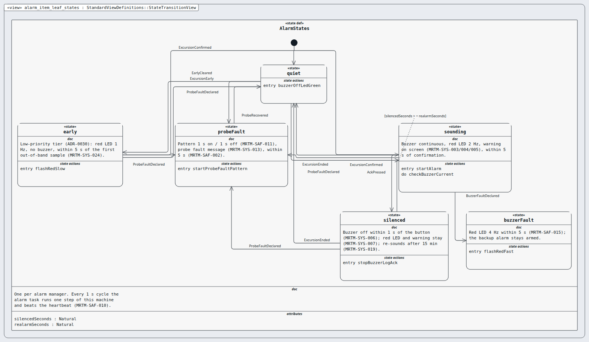

# Node `alarm-item` — alarm item

> MODEL-LEVELS · generated by `tools/levels-build.py index` from `.ejadah/rew/framework.yaml` · DRAFT — needs Masood's review

| | |
|---|---|
| Kind | software-item (IEC 62304 §5.3.1 software item, §4.3 its own class) |
| Role | leaf — chosen or written, not broken down further |
| IEC 62304 class | **C** — reason in each requirement's `## Safety` section and ADR-0034 |
| Parent | `alarm` → [INDEX](../INDEX.md) |
| Children | — (leaf) |
| Units (bottom) | alarmMgr |

## Pictures, in reading order

1. **`alarm_item_leaf_states`** — the alarm item's state machine (solution detail)

   

## Requirements this node satisfies (4) — and nothing else

| Id | Title | Derived from (parent node) | Class |
|---|---|---|---|
| [MRTM-ALI-001](../../../../03-requirements/mrtm/alarm/alarm-item/MRTM-ALI-001.md) | Alarm item early light | ["MRTM-ALM-001"] | C |
| [MRTM-ALI-002](../../../../03-requirements/mrtm/alarm/alarm-item/MRTM-ALI-002.md) | Alarm item buzzer on | ["MRTM-ALM-003"] | C |
| [MRTM-ALI-003](../../../../03-requirements/mrtm/alarm/alarm-item/MRTM-ALI-003.md) | Alarm item buzzer off | ["MRTM-ALM-004"] | C |
| [MRTM-ALI-004](../../../../03-requirements/mrtm/alarm/alarm-item/MRTM-ALI-004.md) | Alarm item heartbeat | ["MRTM-ALM-005"] | C |

## Model files

`NodeAlarmItem.sysml`
