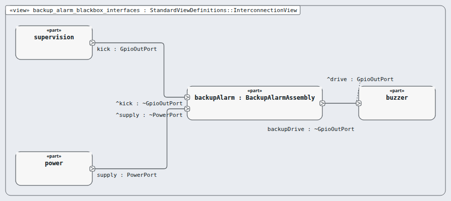
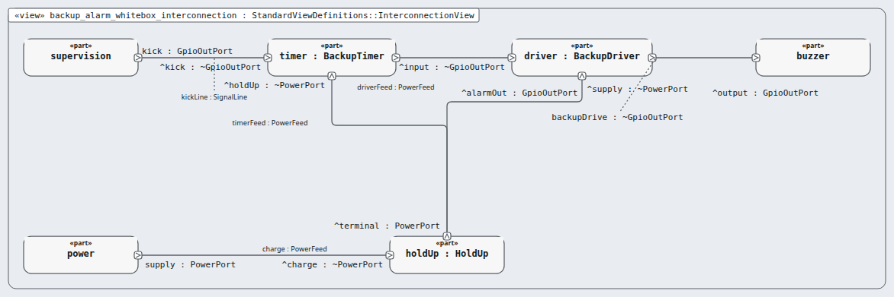

# Node `backup-alarm` — backup alarm

> MODEL-LEVELS · generated by `tools/levels-build.py index` from `.ejadah/rew/framework.yaml` · DRAFT — needs Masood's review

| | |
|---|---|
| Kind | assembly (IEC 60601-1 cl. 14.8 (a subsystem that repeats the step)) |
| Role | black box, then white box (the MagicGrid step) |
| IEC 62304 class | **C** — reason in each requirement's `## Safety` section and ADR-0034 |
| Parent | `alarm` → [INDEX](../INDEX.md) |
| Children | [`backup-timer`](backup-timer/INDEX.md), [`backup-driver`](backup-driver/INDEX.md), [`hold-up`](hold-up/INDEX.md) |
| Units (bottom) | — |

## Pictures, in reading order

1. **`backup_alarm_blackbox_interfaces`** — the node as ONE box, with the neighbours it is wired to (its promises face outward)

   

2. **`backup_alarm_whitebox_interconnection`** — inside the node: its parts and their wires, and where the wires leave the node

   

## Requirements this node satisfies (2) — and nothing else

| Id | Title | Derived from (parent node) | Class |
|---|---|---|---|
| [MRTM-BKA-001](../../../../03-requirements/mrtm/alarm/backup-alarm/MRTM-BKA-001.md) | Backup alarm timeout | ["MRTM-ALM-005"] | C |
| [MRTM-BKA-002](../../../../03-requirements/mrtm/alarm/backup-alarm/MRTM-BKA-002.md) | Backup alarm hold-up | ["MRTM-ALM-008"] | C |

## Model files

`NodeBackupAlarm.sysml`, `NodeBackupAlarmContext.sysml`, `NodeBackupAlarmWhiteBox.sysml`
