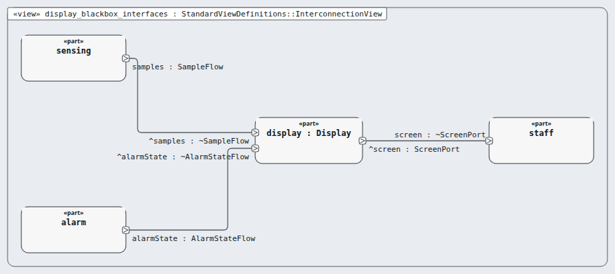
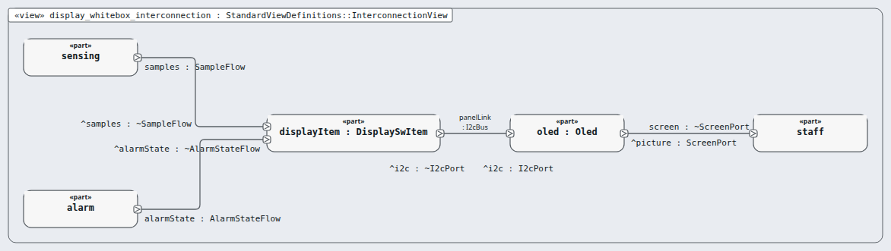

# Node `display` — display

> MODEL-LEVELS · generated by `tools/levels-build.py index` from `.ejadah/rew/framework.yaml` · DRAFT — needs Masood's review

| | |
|---|---|
| Kind | subsystem (IEC 60601-1 cl. 14.8 PEMS architecture) |
| Role | black box, then white box (the MagicGrid step) |
| IEC 62304 class | **C** — reason in each requirement's `## Safety` section and ADR-0034 |
| Parent | `system` → [INDEX](../INDEX.md) |
| Children | [`oled`](oled/INDEX.md), [`display-item`](display-item/INDEX.md) |
| Units (bottom) | — |

## Pictures, in reading order

1. **`display_blackbox_interfaces`** — the node as ONE box, with the neighbours it is wired to (its promises face outward)

   

2. **`display_whitebox_interconnection`** — inside the node: its parts and their wires, and where the wires leave the node

   

## Requirements this node satisfies (3) — and nothing else

| Id | Title | Derived from (parent node) | Class |
|---|---|---|---|
| [MRTM-DSP-001](../../../03-requirements/mrtm/display/MRTM-DSP-001.md) | Display excursion warning | ["MRTM-SYS-005","MRTM-SYS-007"] | C |
| [MRTM-DSP-002](../../../03-requirements/mrtm/display/MRTM-DSP-002.md) | Display temperature | ["MRTM-SYS-011","MRTM-PRF-004","MRTM-IFC-004"] | C |
| [MRTM-DSP-003](../../../03-requirements/mrtm/display/MRTM-DSP-003.md) | Display messages | ["MRTM-SYS-013","MRTM-SAF-012","MRTM-SAF-016","MRTM-SYS-022"] | C |

## Model files

`NodeDisplay.sysml`, `NodeDisplayContext.sysml`, `NodeDisplayWhiteBox.sysml`
