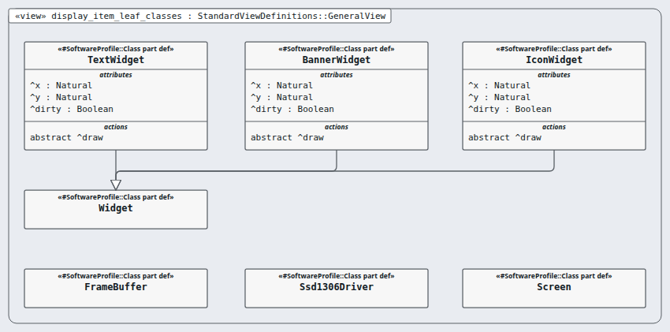

# Node `display-item` — display item

> MODEL-LEVELS · generated by `tools/levels-build.py index` from `.ejadah/rew/framework.yaml` · DRAFT — needs Masood's review

| | |
|---|---|
| Kind | software-item (IEC 62304 §5.3.1 software item, §4.3 its own class) |
| Role | leaf — chosen or written, not broken down further |
| IEC 62304 class | **C** — reason in each requirement's `## Safety` section and ADR-0034 |
| Parent | `display` → [INDEX](../INDEX.md) |
| Children | — (leaf) |
| Units (bottom) | displayMgr |

## Pictures, in reading order

1. **`display_item_leaf_classes`** — the display item's classes (solution detail)

   

## Requirements this node satisfies (2) — and nothing else

| Id | Title | Derived from (parent node) | Class |
|---|---|---|---|
| [MRTM-DSI-001](../../../../03-requirements/mrtm/display/display-item/MRTM-DSI-001.md) | Display item redraw | ["MRTM-DSP-001","MRTM-DSP-003"] | C |
| [MRTM-DSI-002](../../../../03-requirements/mrtm/display/display-item/MRTM-DSI-002.md) | Display item number rate | ["MRTM-DSP-002"] | C |

## Model files

`NodeDisplayItem.sysml`
