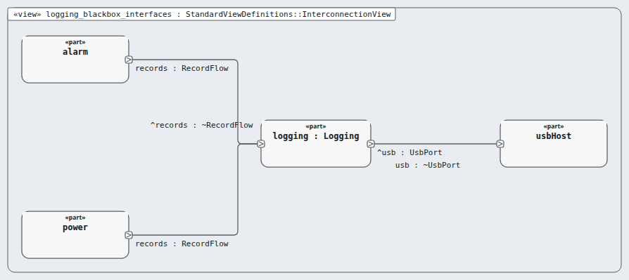
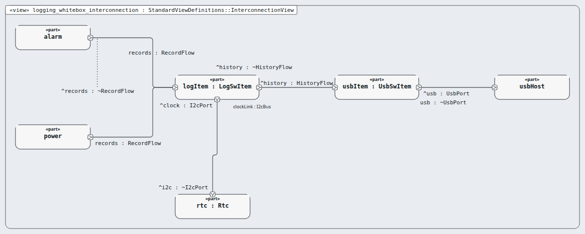

# Node `logging` — logging and history

> MODEL-LEVELS · generated by `tools/levels-build.py index` from `.ejadah/rew/framework.yaml` · DRAFT — needs Masood's review

| | |
|---|---|
| Kind | subsystem (IEC 60601-1 cl. 14.8 PEMS architecture) |
| Role | black box, then white box (the MagicGrid step) |
| IEC 62304 class | **C** — reason in each requirement's `## Safety` section and ADR-0034 |
| Parent | `system` → [INDEX](../INDEX.md) |
| Children | [`rtc`](rtc/INDEX.md), [`log-item`](log-item/INDEX.md), [`usb-item`](usb-item/INDEX.md) |
| Units (bottom) | — |

## Pictures, in reading order

1. **`logging_blackbox_interfaces`** — the node as ONE box, with the neighbours it is wired to (its promises face outward)

   

2. **`logging_whitebox_interconnection`** — inside the node: its parts and their wires, and where the wires leave the node

   

## Requirements this node satisfies (4) — and nothing else

| Id | Title | Derived from (parent node) | Class |
|---|---|---|---|
| [MRTM-LOG-001](../../../03-requirements/mrtm/logging/MRTM-LOG-001.md) | Logging record write | ["MRTM-SAF-018","MRTM-SYS-008","MRTM-SYS-009","MRTM-SYS-010"] | C |
| [MRTM-LOG-002](../../../03-requirements/mrtm/logging/MRTM-LOG-002.md) | Logging retention | ["MRTM-SYS-015"] | C |
| [MRTM-LOG-003](../../../03-requirements/mrtm/logging/MRTM-LOG-003.md) | Logging read-only export | ["MRTM-SYS-014","MRTM-IFC-003","MRTM-PRF-003"] | C |
| [MRTM-LOG-004](../../../03-requirements/mrtm/logging/MRTM-LOG-004.md) | Logging time stamp | ["MRTM-SYS-020","MRTM-SYS-008","MRTM-SAF-022"] | C |

## Model files

`NodeLogging.sysml`, `NodeLoggingContext.sysml`, `NodeLoggingWhiteBox.sysml`
