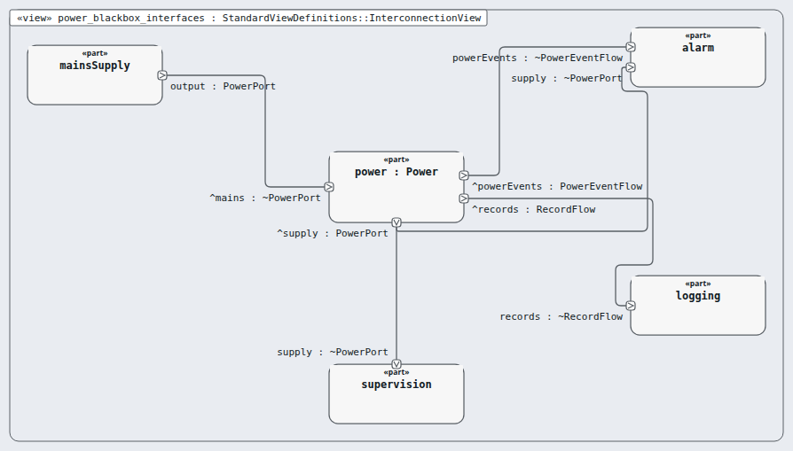
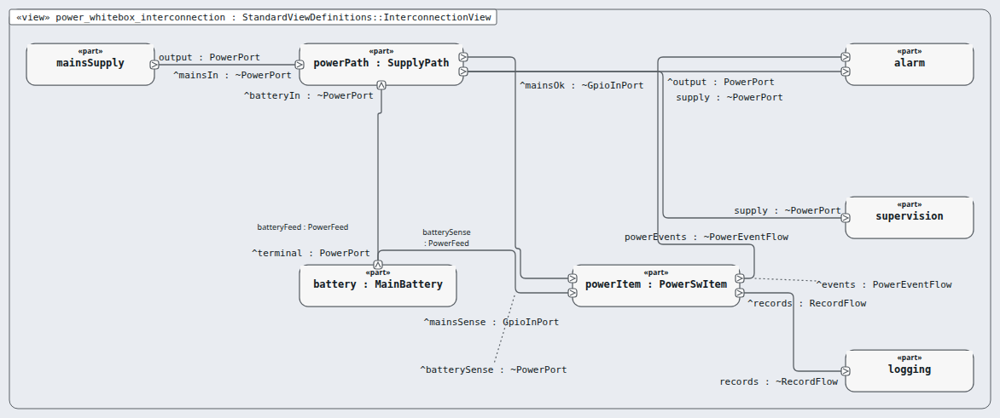

# Node `power` — power

> MODEL-LEVELS · generated by `tools/levels-build.py index` from `.ejadah/rew/framework.yaml` · DRAFT — needs Masood's review

| | |
|---|---|
| Kind | subsystem (IEC 60601-1 cl. 14.8 PEMS architecture) |
| Role | black box, then white box (the MagicGrid step) |
| IEC 62304 class | **C** — reason in each requirement's `## Safety` section and ADR-0034 |
| Parent | `system` → [INDEX](../INDEX.md) |
| Children | [`battery`](battery/INDEX.md), [`power-path`](power-path/INDEX.md), [`power-item`](power-item/INDEX.md) |
| Units (bottom) | — |

## Pictures, in reading order

1. **`power_blackbox_interfaces`** — the node as ONE box, with the neighbours it is wired to (its promises face outward)

   

2. **`power_whitebox_interconnection`** — inside the node: its parts and their wires, and where the wires leave the node

   

## Requirements this node satisfies (3) — and nothing else

| Id | Title | Derived from (parent node) | Class |
|---|---|---|---|
| [MRTM-PWR-001](../../../03-requirements/mrtm/power/MRTM-PWR-001.md) | Power switch-over | ["MRTM-SYS-016"] | C |
| [MRTM-PWR-002](../../../03-requirements/mrtm/power/MRTM-PWR-002.md) | Power battery time | ["MRTM-ENV-001"] | C |
| [MRTM-PWR-003](../../../03-requirements/mrtm/power/MRTM-PWR-003.md) | Power events | ["MRTM-SAF-005","MRTM-SAF-008","MRTM-SYS-023"] | C |

## Model files

`NodePower.sysml`, `NodePowerContext.sysml`, `NodePowerWhiteBox.sysml`
