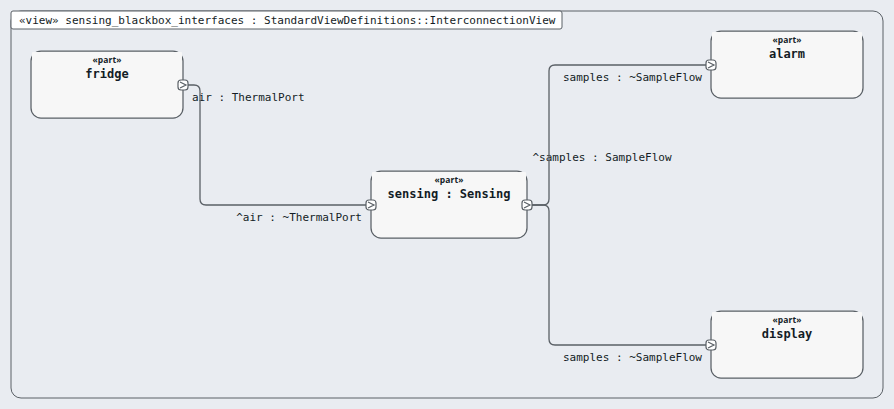
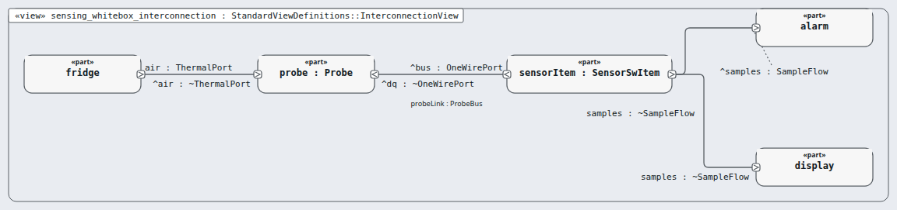

# Node `sensing` — sensing

> MODEL-LEVELS · generated by `tools/levels-build.py index` from `.ejadah/rew/framework.yaml` · DRAFT — needs Masood's review

| | |
|---|---|
| Kind | subsystem (IEC 60601-1 cl. 14.8 PEMS architecture) |
| Role | black box, then white box (the MagicGrid step) |
| IEC 62304 class | **C** — reason in each requirement's `## Safety` section and ADR-0034 |
| Parent | `system` → [INDEX](../INDEX.md) |
| Children | [`probe`](probe/INDEX.md), [`sensor-item`](sensor-item/INDEX.md) |
| Units (bottom) | — |

## Pictures, in reading order

1. **`sensing_blackbox_interfaces`** — the node as ONE box, with the neighbours it is wired to (its promises face outward)

   

2. **`sensing_whitebox_interconnection`** — inside the node: its parts and their wires, and where the wires leave the node

   

## Requirements this node satisfies (4) — and nothing else

| Id | Title | Derived from (parent node) | Class |
|---|---|---|---|
| [MRTM-SEN-001](../../../03-requirements/mrtm/sensing/MRTM-SEN-001.md) | Sensing sample period | ["MRTM-SYS-001"] | C |
| [MRTM-SEN-002](../../../03-requirements/mrtm/sensing/MRTM-SEN-002.md) | Sensing sample latency | ["MRTM-SYS-024"] | C |
| [MRTM-SEN-003](../../../03-requirements/mrtm/sensing/MRTM-SEN-003.md) | Sensing accuracy | ["MRTM-PRF-001","MRTM-ENV-004"] | C |
| [MRTM-SEN-004](../../../03-requirements/mrtm/sensing/MRTM-SEN-004.md) | Sensing invalid sample | ["MRTM-SYS-012","MRTM-SAF-003"] | C |

## Model files

`NodeSensing.sysml`, `NodeSensingContext.sysml`, `NodeSensingWhiteBox.sysml`
