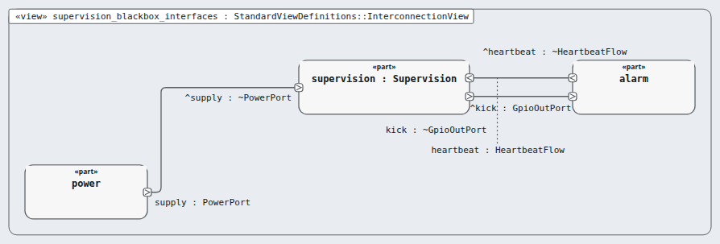
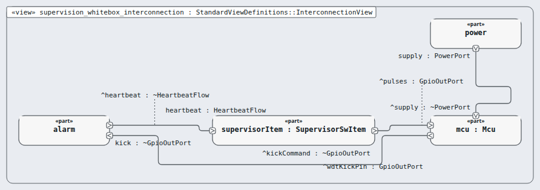

# Node `supervision` — supervision

> MODEL-LEVELS · generated by `tools/levels-build.py index` from `.ejadah/rew/framework.yaml` · DRAFT — needs Masood's review

| | |
|---|---|
| Kind | subsystem (IEC 60601-1 cl. 14.8 PEMS architecture) |
| Role | black box, then white box (the MagicGrid step) |
| IEC 62304 class | **C** — reason in each requirement's `## Safety` section and ADR-0034 |
| Parent | `system` → [INDEX](../INDEX.md) |
| Children | [`mcu`](mcu/INDEX.md), [`supervisor-item`](supervisor-item/INDEX.md) |
| Units (bottom) | — |

## Pictures, in reading order

1. **`supervision_blackbox_interfaces`** — the node as ONE box, with the neighbours it is wired to (its promises face outward)

   

2. **`supervision_whitebox_interconnection`** — inside the node: its parts and their wires, and where the wires leave the node

   

## Requirements this node satisfies (4) — and nothing else

| Id | Title | Derived from (parent node) | Class |
|---|---|---|---|
| [MRTM-SUP-001](../../../03-requirements/mrtm/supervision/MRTM-SUP-001.md) | Supervision restart | ["MRTM-SAF-004","MRTM-SAF-006"] | C |
| [MRTM-SUP-002](../../../03-requirements/mrtm/supervision/MRTM-SUP-002.md) | Supervision power-up tests | ["MRTM-SAF-007","MRTM-SAF-023"] | C |
| [MRTM-SUP-003](../../../03-requirements/mrtm/supervision/MRTM-SUP-003.md) | Supervision band check | ["MRTM-SAF-017","MRTM-SYS-017"] | C |
| [MRTM-SUP-004](../../../03-requirements/mrtm/supervision/MRTM-SUP-004.md) | Supervision pulse stop | ["MRTM-SAF-010"] | C |

## Model files

`NodeSupervision.sysml`, `NodeSupervisionContext.sysml`, `NodeSupervisionWhiteBox.sysml`
