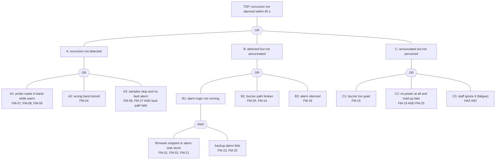

# Fault tree — "excursion not alarmed within the required time"

> **Standard:** IEC 61025:2006 (fault tree analysis) used as ISO 14971:2019 cl. 5.4 input; IEC 62304 cl. 7.1.2. Required time from ADR-0014: buzzer within 65 s of the first out-of-band sample (MRTM-PRF-002).
> **MANUAL** — Sanad has no fault-tree view or cut-set check (F-51); the tree is Mermaid inside this document (PROMPT rule 6: SysML has no fault-tree picture). DRAFT — needs Masood's review.

**In one line:** start from the one bad outcome at the top and ask "what has to go wrong below it?" An **OR** gate means any one child is enough; an **AND** gate means all children must go wrong together.

## Minimal cut sets (the smallest groups of failures that cause the top event)
| # | Cut set | Order | Control that breaks it | Detected? |
|---|---|---|---|---|
| 1 | Probe reads a wrong in-band value (FM-07 in-range, FM-08, FM-09) | 1 | SAF-003 (range), SAF-012 (calibration due), SAF-020 (placement) | partly — slow drift inside range is only caught at calibration |
| 2 | Stored band corrupt (FM-04) | 1 | SAF-017 (CRC alarm) | yes, at power-up |
| 3 | Buzzer path broken (FM-05, FM-14) | 1 | SAF-014 (current sense) → SAF-015 (red 4 Hz) + SAF-007 | yes |
| 4 | Button stuck (FM-18) | 1 | SAF-019, SYS-019 | yes, at 60 s |
| 5 | Buzzer too quiet (FM-15) | 1 | SAF-001 (production test only) | **no** — residual |
| 6 | Staff ignore the sound (HAZ-002) | 1 | SAF-011, SYS-002 (60 s confirmation) | human factor |
| 7 | Firmware stopped **AND** backup alarm failed | 2 | SAF-009 + SAF-023 (backup tested each power-up) | yes, latent part caught at power-up |
| 8 | Samples stop **AND** probe-fault path fails | 2 | SYS-012 + SAF-002, backed by SAF-009 when the cause is the firmware | yes |
| 9 | Battery flat **AND** hold-up capacitor degraded | 2 | SAF-008, SAF-013, derating (EE-REVIEW) | partly |

**Before Phase 5**, "firmware stopped" was a single-point (order 1) cut set: one fault could silence the product. The backup alarm (ADR-0013, A-18) turns it into cut set 7, order 2. That is the main result of this tree.

## Four blocks
- **Assumptions:** A-18, A-19. **Risks:** R-08, R-11. **Open questions:** none new.
- **Trace links:** hazard-analysis.md, fmea.md, ADR-0013, ADR-0014, 06-design/system/MrtmSafety.sysml.
