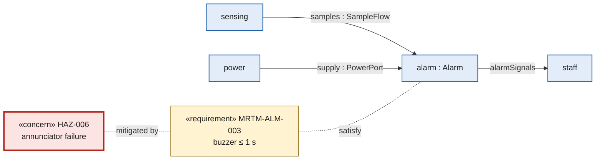

# SysML review with eyes: every picture, the model, and the canvas fixes

> SYSML-EVAL · 2026-09-27 · worker · **DRAFT — needs Masood's review**
> I rendered all 23 run-2 views and the 21 run-1 pictures (plus run 1's allocation table) with `tools/render-view.sh`, using Sanad's own picture stylesheet in light mode. I looked at each PNG. I also checked 3 elements per picture against the `.sysml` files.
> Scratch PNGs: `~/.cache/tmp-sysml-eval/r1`, `r2` (not in the repo).
> Starting standard: `picture-review.md` (F-119…F-123). The quality bar is "editor and AI on par, Cameo-grade" (Cameo is the tool most model reviewers already use).

## At a glance

| | Run 1 (22 views) | Run 2 (23 views) |
|---|---|---|
| Grade A (clean) | 3 | **6** |
| Grade B (small label problems) | 7 | **12** |
| Grade C (hard to read) | 6 | 4 |
| Grade F (wrong or unreadable) | **6** | 1 |
| A reviewer would accept it as-is | 7 of 22 | **9 of 23** |
| Widest picture | **17,592 px** (7 screens of scrolling) | 1,552 px (fits one screen) |
| Views wider than 2,000 px | 6 | 0 |
| Kinds of view present | 8 | **5** (lost: activity, tree, allocation, hazard, hardware blocks, software contracts) |

**In one line:** run 2's pictures are smaller, cleaner and one per node, so they are far easier to read. But they cover fewer kinds of view. The story now stops at the leaf, and nothing shows the step from leaf to code.

**Grade key.** A = a reviewer can use it now. B = readable, but some labels sit in the wrong place. C = connectivity is hard to follow. F = the picture is wrong about the model, or no one could read it.

---

## Part A — every picture

### Run 2 (current tree, `06-design/views/rendered/`)

| View | Node | Kind | Content vs model (3 spot-checks) | Layout | Why | Accept as-is? | What the canvas needs |
|---|---|---|---|---|---|---|---|
| context_top_usecases | context | use case | right: 6 use cases, 5 actors, fridge on DetectExcursion / MonitorTemperature / RaiseAlert | B | use cases drawn as boxes, not ovals; the `include` shows only as a compartment (the arrow is hidden); the fridge→RaiseAlert line takes a long detour | yes | oval use-case shape as an option; an `include` arrow |
| system_blackbox_interfaces | context / system | interconnection | right: airContact, mainsFeed, historyLink, 2 staff wires | B | ports sit on the box edge; wires are square-cornered. The interface names float up to 150 px from their wire. The `mainsFeed` dotted leader crosses a port label. Every label carries a `^` prefix, which is noise | yes, after the labels are fixed | put the wire label at the wire's midpoint; drop `^` unless asked |
| system_whitebox_interconnection | system | interconnection | right: sensing→alarm, alarm→supervision heartbeat, power→alarm supply | **C** | alarm's 5 ports are stacked on one side. The power→alarm and power→supervision wires share one channel. Port labels hang on dotted leaders far from their ports. The outside parts (fridge, mains) have no type | no | F-119 layout rule (C-2) |
| system_whitebox_excursion | system | sequence | right: 10 messages in `succession` order | B | the lifelines strike through message labels (LogRecord, LowPriorityLight). Only the item type shows. No 5 s / 60 s timing (F-123) | yes | label gap at each lifeline; duration constraint (C-5) |
| system_whitebox_powerloss | system | sequence | right: 7 messages | B | **"PowerEvent" is drawn 4 times for 4 different events** (mains lost, lost, battery low, pulses stop), so the reader cannot tell them apart. Lifeline names leak suffixes (alarmP, loggingP, staffP). No 100 ms budget | no | show `name : Type` when a type repeats (F-143) |
| system_whitebox_probefault | system | sequence | right: 5 messages | B | the trigger, "no valid sample for 30 s", is invisible: the arrow just says TemperatureSample. The fault reaches the display as `ExcursionState`. Lifelines end in F (sensingF…) | no | message names; a timeout / duration mark |
| system_whitebox_modes | system (firmware) | state | right: 4 states, 5 transitions | **A** | clean; one small jog on MainsLost. It is byte-for-byte the run-1 picture. It shows firmware modes but sits under the system node | yes | — |
| alarm_blackbox_interfaces | alarm | interconnection | right: 8 ports, 6 neighbours | B | neighbours are placed on the side of their wire (good). The records label sits above the alarmState wire. The powerEvents label hangs 130 px below on a leader. Neighbours have no type | yes, after the labels are fixed | labels next to their own port |
| alarm_whitebox_interconnection | alarm | interconnection | right: 13 wires incl. buzzerLine, lightLine, ackLine, backupLine | **C** | alarmItem's 5 ports are stacked on one side. 6 dotted leaders cross the middle. ^lightDrive, ^button and ^contact float with no box. Interface names are in tiny type. The kick wire loops round the bottom-right corner | no | C-2 + C-4 |
| alarm_item_leaf_states | alarm-item | state | right: all 14 transitions present (checked against `MrtmSwStates.sysml` lines 60–73) | **C** | 4 arrowheads meet at one point on `sounding` and land on its doc text. The labels EarlyCleared / ExcursionEarly are stacked. ExcursionConfirmed detours over the whole top. The guard floats on a leader | no | C-4 (spread parallel edges, one entry point per edge) |
| backup_alarm_blackbox_interfaces | backup-alarm | interconnection | right: kick, supply, drive | **A** | clean. Model note: its neighbours (supervision, power) sit OUTSIDE alarm, so the wires skip alarm's boundary (F-145) | yes | — |
| backup_alarm_whitebox_interconnection | backup-alarm | interconnection | right: kickLine, driverFeed, timerFeed, charge | B | the ^output label is stranded between driver and buzzer. holdUp's one terminal feeds timer AND driver on a shared trunk, which reads as one wire | yes, after the labels are fixed | draw a junction dot where one wire splits |
| display_blackbox_interfaces | display | interconnection | right: samples, alarmState, screen | **A** | clean. Model gap: display has no supply port (F-151) | yes | — |
| display_whitebox_interconnection | display | interconnection | right: panelLink I2C, samples, picture→screen | **A** | clean; the i2c port labels hang under the wire. Model: the software item is wired straight to the OLED (no processor) | yes | — |
| display_item_leaf_classes | display-item | block (class) | **WRONG** — see F-141 | **F** | Widget is drawn empty, but it owns x, y, dirty and draw. The subclasses show inherited `^x ^y ^dirty` and `abstract ^draw`, yet each redefines `draw` and owns its own features (glyphHeightPx, setTenths, setMessage, setIcon), which are not drawn. FrameBuffer, Ssd1306Driver and Screen are drawn empty. Screen's 5 parts are not drawn. The parent sits under its children | no | draw owned features first, redefinitions as own; composition edges |
| logging_blackbox_interfaces | logging | interconnection | right: 2 records sources, usb | **A** | clean; two wires merge into one port | yes | — |
| logging_whitebox_interconnection | logging | interconnection | right: clockLink I2C, history, usb | B | the ^records label hangs on a leader. The ^history labels are split across both ends. usbItem (software) is wired straight to usbHost | yes, after the labels are fixed | C-2 |
| power_blackbox_interfaces | power | interconnection | right: mains, powerEvents, records, 2 supply wires | B | the supply wire climbs the right side and crosses records. Alarm's 2 ports crowd its top corner | yes, after the labels are fixed | ports on the side facing the peer |
| power_whitebox_interconnection | power | interconnection | right: batteryFeed, batterySense, mainsOk | **C** | 4 crossings. Parallel wires share one channel. ^mainsSense / ^batterySense sit 80 px below on leaders. The powerEvents label sits beside supervision. The software senses the battery through a `PowerFeed` interface (there is no ADC, the chip that reads a voltage) | no | C-2 + C-4 |
| sensing_blackbox_interfaces | sensing | interconnection | right: air, 2 samples | **A** | clean | yes | — |
| sensing_whitebox_interconnection | sensing | interconnection | right: probeLink, air, samples ×2 | B | the ^samples label hangs on a leader; alarm touches the frame top | yes | — |
| supervision_blackbox_interfaces | supervision | interconnection | right: supply, heartbeat, kick | B | two parallel wires with 4 labels crowded between them | yes, after the labels are fixed | C-4 |
| supervision_whitebox_interconnection | supervision | interconnection | right: pulses, kickCommand, supply | B | ^wdtKickPin collides with a wire and the frame edge. The MCU, which runs ALL the software, appears only inside supervision | yes, after the labels are fixed | C-4 |

### Run 1 (archived, `13-assessment/archive/run-1-views/`)

| View | Node (then: none) | Kind | Content vs model | Layout | Why | Accept? | Canvas needs |
|---|---|---|---|---|---|---|---|
| mrtmUseCases | top | use case | right; shows the `include` arrow (run 2 hides it) | **A** | clean | yes | — |
| mrtmContext | top | interconnection | right, but thin: nurse and technician are not wired | B | one wire only | no | — |
| mrtmExternalInterfaces | system | interconnection | right; the satisfy list repeats ENV-004 and IFC-003 twice | C | ^output lands on the satisfy compartment; a leader crosses the mains box; the fridge wire is 10 px long | no | C-2 |
| mrtmInterfaces | system | interconnection | right | **F** | parts in one column; ports float; dotted wires cross everything; a 30-row satisfy list inside the frame (picture-review) | no | C-2 |
| mrtmHwInterfaces | hardware | interconnection | **wrong**: redefined parts are unnamed; most wires are missing (F-60/61) | **F** | ports float off the left edge; "^i2c" labels overprint each other | no | C-2 + draw `:>>` parts |
| mrtmSwWiring | firmware | interconnection | right | C | an 8-box column 2,269 px tall; allocate wires loop over the boxes; ×3 bundles | no | C-2/C-3 |
| mrtmBlocks | system | block | right | C | 7,174 px wide; empty band on top; allocate detours over the top; wires overdraw parts (picture-review) | no | C-3 |
| mrtmHwBlocks | hardware | block | right: 12 components, 6 wiring defs, pin attributes | B | tall (2,374 px), but boxes are readable; generalisation trunk is fine | yes | — |
| mrtmSafetyBlocks | safety | block | right: 8 hazards + scores; control list repeats SAF-009 ×3, SAF-010 ×2 … | B | hazard→control links not drawn (F-52) | yes | — |
| mrtmSafetyReqs | safety | requirement | **wrong for its purpose**: draws Hazard's 4 attributes as floating boxes and no requirement | **F** | nothing a requirement reviewer wants | no | a real requirement view |
| mrtmSwComponents | firmware | block | right; stereotypes carry weight | C | 6,152 px wide, about 50 boxes; unreadable at screen size | no | C-3 + split per node |
| mrtmSwContracts | firmware | block | right: every C function with pre/post/algorithm (the leaf→code link) | C | **14,098 px wide**; readable only when zoomed, 7 screens | no | C-3 + split per unit |
| mrtmSwCodes | firmware | block | right: 2 enums | **A** | clean | yes | — |
| mrtmDisplayClasses | display | block (class) | **wrong** (same bug as run 2, F-141) | **F** | see run-2 row | no | as run 2 |
| mrtmSeqExcursion | firmware | sequence | right | B | 2,252 px wide; no timing | yes | C-5 |
| mrtmSeqPowerLoss | firmware | sequence | right; LogRecord ×4 is ambiguous | B | same as run 2 | no | message names |
| mrtmSeqProbeFault | firmware | sequence | right | B | lifelines strike through labels | yes | — |
| mrtmAlarmStates | firmware | state | right | B | 3 stacked ProbeFaultDeclared labels; a floating guard (picture-review) | yes | C-4 |
| mrtmSystemModes | firmware | state | right | **A** | clean | yes | — |
| mrtmDataFlow | logical | activity | **wrong**: 4 of 7 actions are not drawn (one is clipped to "e"); arrows point at nothing; lanes are empty | **F** | — | no | fix the action-flow canvas |
| mrtmContainment | all | tree | right | **F** | a tree in ONE row, **17,592 px wide** × 341 px | no | wrap rows / fold (C-3) |
| mrtmAllocation | logical | allocation table | thin: a 1×2 table with one dot | C | says almost nothing | no | row per element, not per package |

### Totals

| Kind | Run 1 | Run 2 |
|---|---|---|
| use case | 1 | 1 |
| interconnection | 5 (F 2, C 2, B 1) | **16** (A 5, B 8, C 3) |
| block / class | 8 | 1 |
| sequence | 3 | 3 |
| state | 2 | 2 |
| activity (functional flow) | 1 (F) | **0** |
| tree (containment) | 1 (F) | **0** |
| allocation | 1 | **0** |
| requirement | 1 (F) | **0** |
| parametric (budgets, equations) | 0 | **0** |

| Grade | Run 1 | Run 2 |
|---|---|---|
| A | 3 | 6 |
| B | 7 | 12 |
| C | 6 | 4 |
| F | 6 | 1 |

**What changed:** run 2 swapped a few huge pictures for many small ones (≤ 12 boxes, one node each). That alone moved 5 pictures into grade A and removed every scroll-wide picture. What did NOT change: the interconnection layout still puts ports on one side and labels on dotted leaders (F-119 is half-fixed: ports now sit on the edge, but they do not face their peer). And the class-view bug came across unchanged.

---

## Part B — the model itself (scores 0–5)

| Area | Score | One line |
|---|---|---|
| Parts and ports | 3 | Port defs carry flow items and `~` conjugation is used correctly. But the white box is modelled as a specialisation (`AlarmWhiteBox :> Alarm`) plus a second copy of each part at package level (the F-129 workaround). A Cameo user expects the parts and wires to live *inside* the block. |
| Connections and interfaces | 2 | 74 plain `connect` against 13 typed `interface` in the node tree. 52 neighbour parts have no type (`part display { port … }`). Cameo would flag untyped ends. |
| Delegation (black box ↔ white box) | 1 | White-box wires skip the parent's boundary ports: backupAlarm connects straight to supervision and power, past alarm's `kick`/`supply`. Nothing checks that the white box uses exactly the black box's ports (F-145). |
| satisfy | 4 | Own-node only, one satisfy per requirement per node, clean (F-124 rule works). |
| derive / verify in the model | 1 | 0 `#derivation` and 0 `verify` in any `.sysml`. Derive lives in Markdown front matter and verify in `11-verification`. A SysML-only reader sees requirements that float free (F-149). |
| allocate | 1 | 34 allocations, all in run-1 packages (MrtmSoftware, MrtmPartitions). The node tree has 0. Software items are wired to hardware instead of being allocated to the MCU (F-151). |
| Redefinition | 3 | `:>>` is used well for part numbers and `draw`. Leaves `:>` the run-1 definitions (good reuse). But the canvas draws neither properly (F-60, F-141). |
| Profile (stereotypes) | 2 | `#Thread` / `#Service` / `#Component` / `#Interface` carried real weight in run 1 (priority, period, stack). The node tree uses none. `#SoftwareProfile::Class` and `#logical`/`#physical` are decoration: no rule reads them. |
| Naming | 3 | Elements are clear. The noise: lifeline suffixes (alarmP, sensingF), snake_case view names beside CamelCase elements, and the view name `system_blackbox_interfaces` exposing package `NodeContext`. |
| Package per node | 4 | Node / NodeWhiteBox / NodeContext + Req per node, each in its own folder with an INDEX. A tidy structure; the import cycles were fixed (F-137). |
| Requirement packages per node | 3 | Generated and byte-stable. But **the same 132 ids are declared twice**: once in `ProjectRequirements`, once in the per-node `Req*` packages (F-150). |
| Behaviour | 3 | State machines are good. Sequences are package-level parts + messages + a straight chain of `succession`, not an `occurrence def` scenario. No parallel steps, no timing, no activity at all. |
| View-kind coverage for a design review | 1 | Present: use case, interconnection, sequence, state, one class view. **Missing entirely in run 2:** decomposition tree (BDD, the family-tree picture of parts), activity / functional flow, requirement diagram, parametric (budgets: 5 s, 60 s, 100 ms, the mA power budget from the part data), allocation, hazard→control. |
| Decomposition story in pictures | 2 | Context → system black box → system white box → subsystem black/white box works (the Russian-doll opening reads well). It stops at the leaf: 20 of 22 leaves have no picture, and no picture joins a leaf to its code (the 14,098 px contracts view is archived). |

**What the Pilot accepts that a Cameo reviewer would flag:** untyped neighbour parts; plain `connect` without an interface type; wires skipping the parent boundary; the same requirement id in two packages; the white box as a subtype; sequences with no enclosing scenario; software items with I2C / USB ports wired straight to devices; display, logging and sensing with no power supply at all.

---

## Part C — designs for the canvas (proposed stage-1 sentences)

Each is one claim, `proposed`, id not allocated. The organisation configures; we recommend.

### C-1 Colour theme by element kind (F-122)

> **SAN-SYSML-NNN (proposed):** The canvas shall draw each element kind with the fill, stroke and label colour that the organisation's picture theme names for that kind, show a legend of the kinds present when the user asks, and keep every kind distinguishable without colour.

**Design note.** Think of a subway map: each line has its own colour, and the key in the corner says which is which. The theme is one file (`.ejadah/rew/picture-theme.yaml`), chosen in Setup: the organisation configures it and we recommend. Kinds: part, port/interface, requirement, state, lifeline/message, hazard/risk control, stereotype chip. Each kind has `fill`, `stroke`, `text`, and a **non-colour cue** (line style or corner shape).

The quality bar says "theme tokens only". So the recommended theme names VS Code chart tokens (`charts.blue`, `charts.green`, `charts.yellow`, `charts.purple`, `charts.red`, `editor.foreground`). The editor already redefines those for light, dark and high contrast. The fill is the token mixed at about 12% into the editor background. The hex values below are the print / fallback values.

**Contrast rule (checked by a script, all pass):** text on fill ≥ 4.5:1 (WCAG AA); stroke on canvas ≥ 3:1 (WCAG non-text); colour is never the only cue (WCAG 1.4.1). An org theme that breaks the rule is refused, with the failing pair named.

**Greyscale:** the pale fills all print as near-white (luminance 0.82–0.92), so in print the non-colour cue carries the meaning. In high contrast, fills drop out and the strokes use the high-contrast border colour.

| Kind | Light fill | Light stroke | Text | Dark fill / stroke | Non-colour cue | Contrast (light text/fill · stroke/canvas) |
|---|---|---|---|---|---|---|
| part | #E3EDFA | #1F5FA8 | #1B1B1B | #1D2A3A / #6CA6F0 | square corners, 1.5 px | 14.6 · 6.0 |
| port / interface | #E2F2E6 | #1E7B34 | #1B1B1B | #1C2E22 / #5CC27A | small square on the edge; wire 1 px | 14.8 · 4.9 |
| requirement | #FFF3D1 | #8A6100 | #1B1B1B | #332B14 / #E0B84A | folded top-right corner | 15.6 · 5.1 |
| state | #EFE7FA | #6B3FA0 | #1B1B1B | #2A2238 / #B592E8 | fully rounded corners | 14.3 · 6.8 |
| lifeline / message | #E0F2F2 | #0F6E6E | #1B1B1B | #15302F / #4FC6C6 | dashed lifeline | 14.9 · 5.6 |
| hazard / risk control | #FCE4E2 | #B3261E | #1B1B1B | #3A1F1E / #F2877F | hazard: double border; control: dashed border | 14.2 · 6.0 |
| stereotype chip | none | #5B5B5B | #1B1B1B | none / #A8A8A8 | «keyword» in italics | 15.9 · 6.3 |

The check lives at `~/.cache/tmp-sysml-eval/contrast.py`. It is a 30-line assert script and becomes the theme validator's first test.

Sketch of one coloured picture (alarm black box):

Legend (drawn bottom-right on request): ■ part · ▫ port · ◰ requirement · ◯ state · ┆ lifeline · ▣ hazard.

### C-2 Interconnection layout (F-119)

> **SAN-SYSML-NNN (proposed):** In an interconnection view the canvas shall place each part by its connections, put each port on the edge of its box that faces the port it connects to, and draw each wire as right-angled segments from edge to edge with its label beside the wire.

**Design note.** Like seating guests: people who talk to each other sit next to each other, and each one faces the person they talk to. Steps: (1) Layer the parts by wire direction (sources left, sinks right), in the Sugiyama style that tools like ELK "layered" use. Inside each layer, order the parts by barycentre (the average position of their neighbours) to cut crossings. (2) Each port goes to the side of its box nearest its peer's centre. Ports on one side are ordered by their peer's position, so wires do not cross at the box. (3) Wires are orthogonal (right-angled only). Two wires never share a channel for more than one grid step; the router keeps an 8 px gap. (4) The port label sits touching its port on the outside; the wire label sits at the wire's longest straight segment, offset 4 px. **No dotted leaders** unless the user drags a label away. (5) A user's manual position (the Layout metadata) always wins; auto-layout only places what the user has not placed. That is editor and AI on par. Today 9 of 16 interconnection views have at least one label on a dotted leader.

### C-3 Rank placement and edge routing for general views (F-120)

> **SAN-SYSML-NNN (proposed):** In a general view the canvas shall start the first row of boxes at the top margin, wrap any row wider than the view width into further rows, and route allocate and satisfy lines along the side of the boxes they join, not around the picture.

**Design note.** Like writing on a page: start at the top, and when the line is full, go to the next line. The empty band above row one comes from ranking the tallest box first and aligning the others to its bottom. Align to the top instead. A row that would pass the width limit (default 1,600 px, the org can change it) wraps. That alone would have folded the 17,592 px tree and the 14,098 px contracts view into readable pages. Allocate and satisfy lines are drawn as short side-routed links between neighbours. If the two ends are more than two rows apart, draw a small named stub at each end ("→ alarmTask") instead of a line across the picture. Cameo users know this as a "shortcut" label.

### C-4 Label collision (F-121)

> **SAN-SYSML-NNN (proposed):** The canvas shall spread parallel edges between the same two elements apart, give each edge its own entry point on the box, and move any edge label that would overlap another label or box until it does not.

**Design note.** Like cars in parallel lanes: each gets its own lane, and the signs do not sit on top of each other. Parallel edges get 12 px apart and a separate anchor on the box side. Anchors are spread evenly along the side, never 4 on one point, as seen on `sounding`. Labels are placed by trying positions near the midpoint (above, below, left, right, then along the edge) and taking the first free one. If none is free, the label moves to a numbered footnote under the picture. A lifeline never crosses a message label: the label gets a background gap.

### C-5 Timing on sequences (F-123)

> **SAN-SYSML-NNN (proposed):** A sequence view shall draw a duration constraint between two messages as a bracket beside the lifelines, labelled with the budget and its requirement id, when the model holds a constraint on the time between those two messages.

**Design note.** Like a stopwatch drawn on the margin: "from here to here, at most 5 s". The model side is idiomatic SysML v2: the scenario becomes an `occurrence def`, its messages are named events, and a `constraint { (sounding.time - warmAir.time) <= 5[s] }` names the two ends. The bracket is drawn on the right margin between the two message rows, labelled `≤ 5 s · MRTM-SYS-003`. A budget that is only text in a comment (like today's `SystemExcursion.sysml` header) is not drawn. Instead, the check says "timing is in a comment, not in the model". This also needs message names on the picture when an item type repeats (F-143).

### C-6 "Picture fit for review" check

> **SAN-SYSML-NNN (proposed):** The gate shall measure every rendered view for overlaps, detached labels, empty area, width and box count, and report each view that passes an organisation limit, naming the view and the measure it failed.

**Design note.** Like a spell-checker for pictures: it cannot judge whether the picture is good, but it catches the obvious mistakes before a person looks. It runs on the SVG the canvas already writes, so there is no extra drawing.

| Measure | How | Recommended limit (org can change) | Run 1 worst | Run 2 worst |
|---|---|---|---|---|
| Box / label overlaps | bounding-box intersections | 0 | many (mrtmInterfaces) | 0 boxes; labels touch wires in 6 views |
| Detached labels | label farther than 24 px from its port or edge, or on a dotted leader | 0 (warn at 1) | ~20 (mrtmInterfaces) | 6 (alarm white box) |
| Empty-area ratio | 1 − (area of boxes and labels ÷ picture area) | ≤ 0.75 | ~0.8 (mrtmBlocks band) | ~0.7 (system black box) |
| Width | picture width in px | ≤ 1,600 (one screen) | 17,592 | 1,552 |
| Boxes per view | count | ≤ 12 (level-check already has it) | ~50 | 12 |
| Edge crossings | segment intersections | ≤ 3 | many | 4 (power white box) |
| Edges into one point | anchors closer than 6 px | 0 | 3 | 4 (`sounding`) |

The check must be honest: it proves the picture is *tidy*, not that it is *right*. The class-view bug (F-141) would pass it. So "right" stays a model-vs-picture check: every owned feature of an exposed element is drawn, or the view says it is hidden.

---

## Top 10 by value

| # | What | Why it matters | Finding |
|---|---|---|---|
| 1 | Interconnection layout rule (C-2) | 16 of 23 run-2 pictures are interconnections; 4 of the 5 C/F grades are in this family | F-119, F-142 |
| 2 | Class view draws the wrong features | a picture that says the wrong thing is worse than no picture | F-141 |
| 3 | Add the missing view kinds: decomposition tree, activity, requirement, parametric | a design review needs them; run 2 has none | F-148 |
| 4 | Sequence message names + timing (C-5) | 2 of 3 scenarios cannot be followed without the model open | F-143, F-123 |
| 5 | "Fit for review" gate check (C-6) | turns "look at it" into a number the gate runs; catches the 17,592 px case | F-152 |
| 6 | Black box ↔ white box port-delegation check | the Russian dolls must fit: the inner wires must use the outer doll's ports | F-145 |
| 7 | Colour theme by kind (C-1) | the owner's ask; makes kinds readable at a glance | F-122 |
| 8 | derive / verify / constraints inside the model | unlocks the requirement and parametric views and the timing bracket | F-149 |
| 9 | Label collision (C-4) | 10 pictures lose a grade to it | F-121 |
| 10 | Duplicate requirement ids; power and allocation gaps in the model | a Cameo reviewer's first comments | F-150, F-151 |

## Verdict (for Masood)

Run 2's pictures are much better than run 1's. Each is small, fits one screen, and shows one box at a time, like opening Russian dolls one by one. Most are now readable (18 of 23 are A or B). Two problems stop them being review-ready. First, the wiring pictures still put the plugs on the wrong side of the boxes and park their names away from the wires. That is like a map where the street names float in the fields. Second, one picture (the display classes) is simply wrong about the model, and no check noticed. The model itself is tidy, but it is thinner than a Cameo user expects. There is no family-tree picture of the parts, no flow picture, no budget or requirement picture, and nothing that joins a leaf to its code. The six designs in Part C fix the drawing side. They are ready to become stage-1 sentences.

## New findings (F-141 … F-152)

**Appended to `runs/02-magicgrid/FINDINGS.md`** after the RESTRUCTURE commit (b450822) landed. They are numbered F-141…F-152, not F-2-139…: the move had already used F-139 and F-140, and no `F-2-` prefix exists anywhere in the repository.

| # | Phase | Kind | What was needed | What was done instead | Fix class (draft) | Board capability |
|---|---|---|---|---|---|---|
| F-141 | SYSML-EVAL | MANUAL | A class view draws each element's own features and its redefinitions, and composition edges | display_item_leaf_classes (and run 1's mrtmDisplayClasses): Widget drawn empty; subclasses show inherited `^x ^y ^dirty` and `abstract ^draw` although they redefine `draw` and own other features; FrameBuffer / Ssd1306Driver / Screen drawn empty; Screen's 5 parts not drawn. Found by eye only | Existing canvas (general-view compartments) + Verification engine (picture-vs-model feature check) | system-design |
| F-142 | SYSML-EVAL | MANUAL | Port and wire labels touching their port or wire | 9 of 16 run-2 interconnection views park labels on dotted leaders up to 150 px away; ports sit on the edge but not on the side facing their peer (F-119 half-fixed) | Existing canvas (layout) | system-design |
| F-143 | SYSML-EVAL | MANUAL | Sequence messages readable when an item type repeats | powerloss draws "PowerEvent" 4× for 4 events; probefault's 30 s trigger shows as TemperatureSample; message names hidden (the F-131 choice) | Existing canvas (show `name : Type` when the type repeats) | system-design |
| F-144 | SYSML-EVAL | MANUAL | A scenario as one SysML v2 occurrence with its own lifelines | scenarios are package-level parts + messages; lifeline names carry suffixes (alarmP, sensingF) to avoid clashes | Skill (create path writes `occurrence def`) + Existing canvas | system-design |
| F-145 | SYSML-EVAL | MANUAL | White-box wires go through the parent's boundary ports (delegation), checked against the black box | backupAlarm wired straight to supervision / power past alarm's ports; no check compares black-box ports with white-box wires | Verification engine | system-design |
| F-146 | SYSML-EVAL | MANUAL | White box drawn from the block's own parts and connections | white box = specialisation `XWhiteBox :> X` + a second package-level copy of each part and every wire (F-129 workaround) | Existing canvas (draw composite internals, root of F-129) | system-design |
| F-147 | SYSML-EVAL | MANUAL | Typed neighbours and typed connections | 52 anonymous neighbour parts, 74 plain `connect` vs 13 typed `interface` in the node tree; the Pilot accepts it | Verification engine (untyped-end warning, org-configurable) | system-design |
| F-148 | SYSML-EVAL | MANUAL | The view kinds a design review needs, at every node, down to code | run 2 has no decomposition tree, activity, requirement, parametric, allocation or hazard view; 20 of 22 leaves have no picture; the leaf→code contracts view is archived | Workflow (framework cell → required view kinds) + Existing canvas | system-design |
| F-149 | SYSML-EVAL | MANUAL | derive, verify and budget constraints as model elements | 0 `#derivation`, 0 `verify`, 0 `constraint` in any `.sysml`; derive in Markdown front matter; budgets in comments | Traceability engine (emit derive/verify into the generated packages) | traceability |
| F-150 | SYSML-EVAL | MANUAL | One declaration per requirement id | the same 132 ids are declared in `ProjectRequirements` and in the per-node `Req*` packages; no finding raised | Verification engine (duplicate declared id) | requirements |
| F-151 | SYSML-EVAL | MANUAL | Software items allocated to a processor; every powered part has a supply | display, logging and sensing have no supply port; software items carry I2C / USB / battery-sense ports wired straight to devices; 0 allocate in the node tree | Verification engine (unallocated software item; unpowered part — org rules) | system-design |
| F-152 | SYSML-EVAL | MANUAL | A gate check that a picture is fit for review | none; a 17,592 px tree and a 14,098 px view passed the run-1 gate | Verification engine (C-6 measures on the rendered SVG) | system-design |

---
**Assumptions:** grades are my judgement against the Cameo bar, from light-mode renders only (not seen in dark or high contrast). **Risks:** the "accept" column is one reviewer's call. **Open questions:** should C-2 auto-layout re-place views a user has already placed? (proposed: no, only unplaced elements). **Trace links:** picture-review.md, DECOMPOSITION.md, FINDINGS.md F-119…F-138, Sanad `qual/reference/quality-bar.md` §1.
