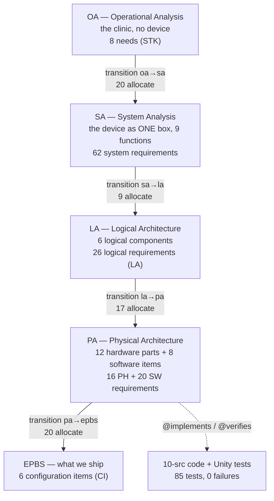

# The decomposition story — Arcadia, five fixed layers (read this first)

**In one line:** we plan the monitor like a trip — first *why go* (the clinic's needs), then *where to* (what the device must do), then *which roads* (logical parts), then *which car* (real parts), then *what to pack* (the things we ship).

DRAFT — needs Masood's review. Framework file: `.ejadah/rew/framework.yaml` (`shape: step`, `repeat: false`, depth pinned at 5). Checked by `python3 tools/level-check.py` (0 violations).

| # | Layer | Question | Pictures (read in order) | Requirements | Index |
|---|---|---|---|---|---|
| 1 | OA — Operational Analysis | What does the clinic need, with no device yet? | `oa_capabilities`, `oa_architecture` | 8 STK | [oa/INDEX.md](oa/INDEX.md) |
| 2 | SA — System Analysis | What must the device do, seen as one box? | `sa_context`, `sa_functions`, `sa_alarm_chain` | 62 (SYS 24 · SAF 23 · PRF 4 · ENV 4 · MNT 3 · IFC 4) | [sa/INDEX.md](sa/INDEX.md) |
| 3 | LA — Logical Architecture | Which logical parts share the work? | `la_architecture`, `la_interfaces` | 26 LA | [la/INDEX.md](la/INDEX.md) |
| 4 | PA — Physical Architecture | Which real parts build it? | `pa_architecture`, `pa_interconnection`, `pa_backup_alarm`, `pa_software` | 36 (PH 16 · SW 20) | [pa/INDEX.md](pa/INDEX.md) |
| 5 | EPBS — End-Product Breakdown | What do we build, buy, version and ship? | `epbs_breakdown` | 6 CI | [epbs/INDEX.md](epbs/INDEX.md) |

**Transitions** (Arcadia's word for "this element went one layer down"): one Sanad `allocate` per element in `transitions/Transitions.sysml`, one readable table per layer pair — [oa-to-sa](transitions/oa-to-sa.md) · [sa-to-la](transitions/sa-to-la.md) · [la-to-pa](transitions/la-to-pa.md) · [pa-to-epbs](transitions/pa-to-epbs.md). The SA→LA one is also a Sanad allocation-matrix view (`transition_sa_la`, a table in the canvas — CLICK-LIST C-3-02).

## The rules (each is a check in `tools/level-check.py`)
1. A layer's model files satisfy **that layer's requirements only** (`<Layer>Trace.sysml`).
2. Every requirement derives from **the layer directly above** (SA may also refine SA, e.g. a safety requirement refining a system requirement).
3. Every requirement reaches a stakeholder need.
4. Every picture has **at most 12 boxes**.
5. Every layer has an INDEX.md that shows every picture.
6. Every element of a layer is **allocated one layer down** (the transitions are complete).

## What moved compared with run 2 (MagicGrid)
- The **same 138 − 6 requirement texts**, re-homed: run 2's system level → SA; its six subsystems → LA; its leaves → PA; new EPBS layer (6 CIs).
- Run 2's backup alarm went **one step deeper** than the other branches. Arcadia has no deeper step, so its three parts sit in PA beside the board; their parents were lifted to the LA requirement (F-3-002).
- The solution library (`library/`) is run 2's parts, software items and states, reused unchanged except the USB item's class (C → B, F-3-007).
