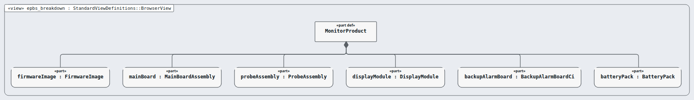

# End-Product Breakdown Structure (EPBS) — layer 5 of 5

**Question this layer answers:** Which things do we build, buy, version and ship?

**Read in this order** (Arcadia viewpoints, drawn by Sanad's canvas, looked at):

| # | Picture | Arcadia viewpoint | What you see |
|---|---|---|---|
| 1 |  `epbs_breakdown.png` | EPBS breakdown tree | The six configuration items we build, buy, version and ship. |

**Requirements of this layer (6, configuration item):** MRTM-CI-001 MRTM-CI-002 MRTM-CI-003 MRTM-CI-004 MRTM-CI-005 MRTM-CI-006

**Model:** the `.sysml` files in this folder; `EpbsTrace.sysml` holds the satisfy lines (this layer's requirements only).
**Derived from:** layer PA.
