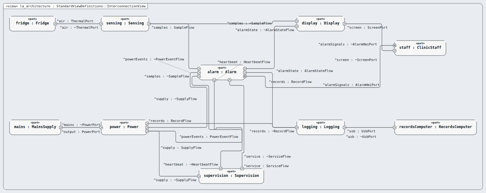
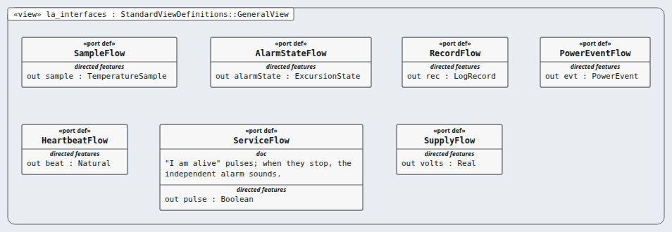

# Logical Architecture (LA) — layer 3 of 5

**Question this layer answers:** How does it work, in ideas only — which logical parts share the work?

**Read in this order** (Arcadia viewpoints, drawn by Sanad's canvas, looked at):

| # | Picture | Arcadia viewpoint | What you see |
|---|---|---|---|
| 1 |  `la_architecture.png` | Logical Architecture Blank (LAB) | Six logical components and the logical wires between them, with the actors at the edge. |
| 2 |  `la_interfaces.png` | Logical interfaces (exchange items) | The seven logical interfaces: what one logical component hands another. |

**Requirements of this layer (26, logical requirement):** MRTM-LA-001 MRTM-LA-002 MRTM-LA-003 MRTM-LA-004 MRTM-LA-005 MRTM-LA-006 MRTM-LA-007 MRTM-LA-008 MRTM-LA-009 MRTM-LA-010 MRTM-LA-011 MRTM-LA-012 MRTM-LA-013 MRTM-LA-014 MRTM-LA-015 MRTM-LA-016 MRTM-LA-017 MRTM-LA-018 MRTM-LA-019 MRTM-LA-020 MRTM-LA-021 MRTM-LA-022 MRTM-LA-023 MRTM-LA-024 MRTM-LA-025 MRTM-LA-026

**Model:** the `.sysml` files in this folder; `LaTrace.sysml` holds the satisfy lines (this layer's requirements only).
**Derived from:** layer SA.
**Goes down to:** [PA](../pa/INDEX.md) through the transition table [`../transitions/la-to-pa.md`](../transitions/la-to-pa.md).
