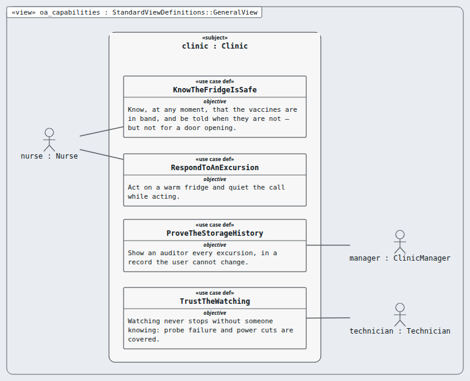
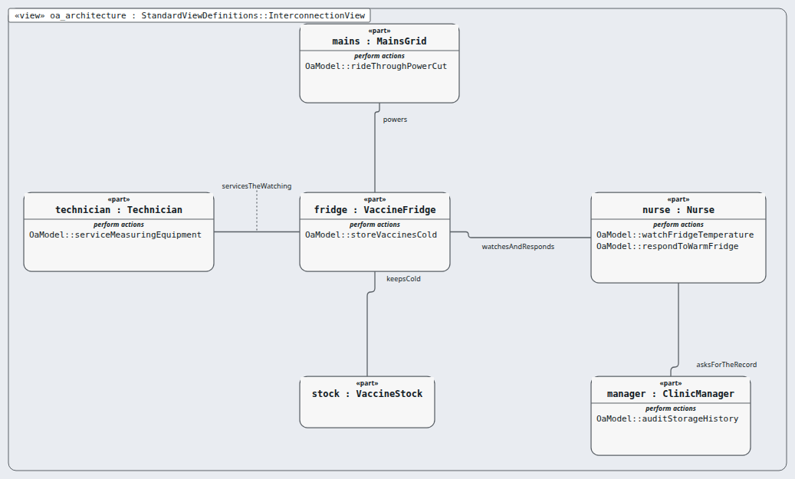

# Operational Analysis (OA) — layer 1 of 5

**Question this layer answers:** What does the clinic need, with NO device in it yet?

**Read in this order** (Arcadia viewpoints, drawn by Sanad's canvas, looked at):

| # | Picture | Arcadia viewpoint | What you see |
|---|---|---|---|
| 1 |  `oa_capabilities.png` | Operational Capability Blank (OCB) | What the clinic must be able to do, and who takes part — four capabilities, no device yet. |
| 2 |  `oa_architecture.png` | Operational Architecture Blank (OAB) | Who is in the clinic, what each one does, and who deals with whom. |

**Requirements of this layer (8, stakeholder need):** MRTM-STK-001 MRTM-STK-002 MRTM-STK-003 MRTM-STK-004 MRTM-STK-005 MRTM-STK-006 MRTM-STK-007 MRTM-STK-008

**Model:** the `.sysml` files in this folder; `OaTrace.sysml` holds the satisfy lines (this layer's requirements only).
**Derived from:** nothing — these are the stakeholder needs.
**Goes down to:** [SA](../sa/INDEX.md) through the transition table [`../transitions/oa-to-sa.md`](../transitions/oa-to-sa.md).
