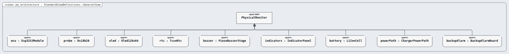
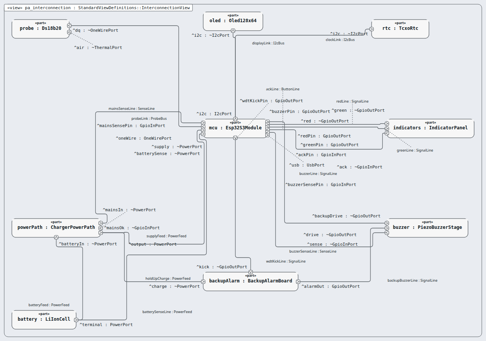
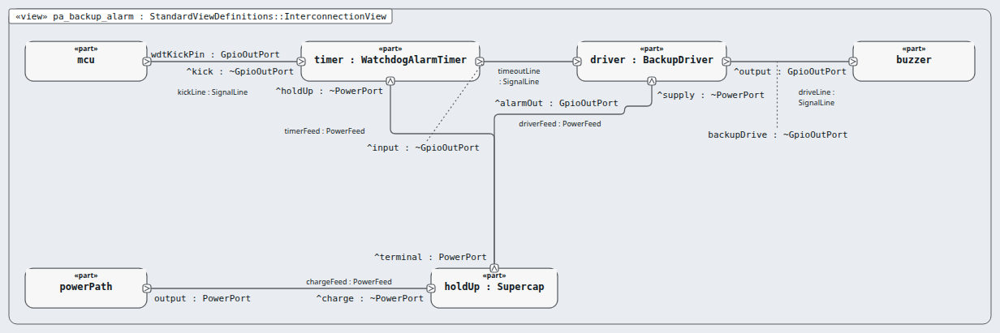
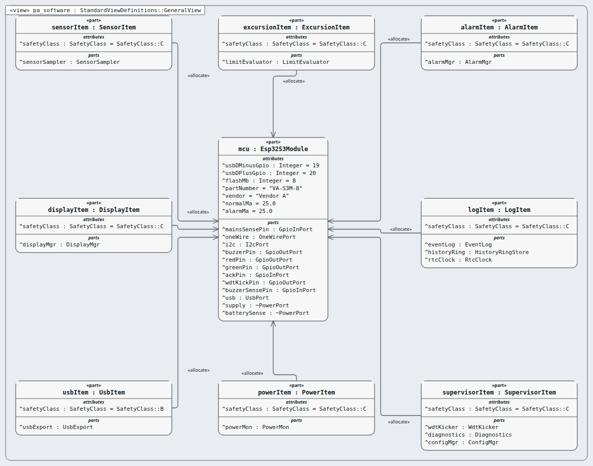

# Physical Architecture (PA) — layer 4 of 5

**Question this layer answers:** Which real parts build it — boards, chips and software?

**Read in this order** (Arcadia viewpoints, drawn by Sanad's canvas, looked at):

| # | Picture | Arcadia viewpoint | What you see |
|---|---|---|---|
| 1 |  `pa_architecture.png` | Physical Architecture Blank (PAB) — node components | What is inside the box: nine node components (hardware). |
| 2 |  `pa_interconnection.png` | Physical links (interconnection) | The physical links: which part is wired to which, by bus or line kind. |
| 3 |  `pa_backup_alarm.png` | Physical links inside one node component (backup alarm board) | Inside the backup alarm board: timer → driver → buzzer, fed by the hold-up store. |
| 4 |  `pa_software.png` | Behaviour components with the software profile | The eight software items (with their IEC 62304 class) deployed on the microcontroller. |

**Requirements of this layer (36, physical (hardware) or software requirement):** MRTM-PH-001 MRTM-PH-002 MRTM-PH-003 MRTM-PH-004 MRTM-PH-005 MRTM-PH-006 MRTM-PH-007 MRTM-PH-008 MRTM-PH-009 MRTM-PH-010 MRTM-PH-011 MRTM-PH-012 MRTM-PH-013 MRTM-PH-014 MRTM-PH-015 MRTM-PH-016 MRTM-SW-001 MRTM-SW-002 MRTM-SW-003 MRTM-SW-004 MRTM-SW-005 MRTM-SW-006 MRTM-SW-007 MRTM-SW-008 MRTM-SW-009 MRTM-SW-010 MRTM-SW-011 MRTM-SW-012 MRTM-SW-013 MRTM-SW-014 MRTM-SW-015 MRTM-SW-016 MRTM-SW-017 MRTM-SW-018 MRTM-SW-019 MRTM-SW-020

**Model:** the `.sysml` files in this folder; `PaTrace.sysml` holds the satisfy lines (this layer's requirements only).
**Derived from:** layer LA.
**Goes down to:** [EPBS](../epbs/INDEX.md) through the transition table [`../transitions/pa-to-epbs.md`](../transitions/pa-to-epbs.md).
