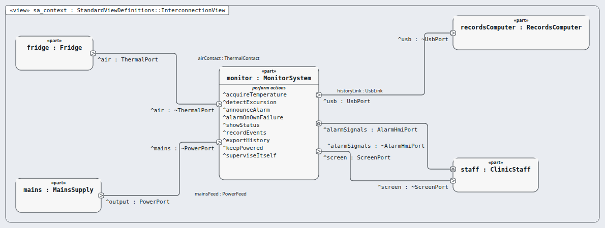
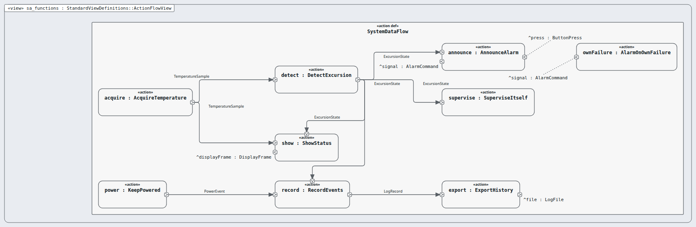
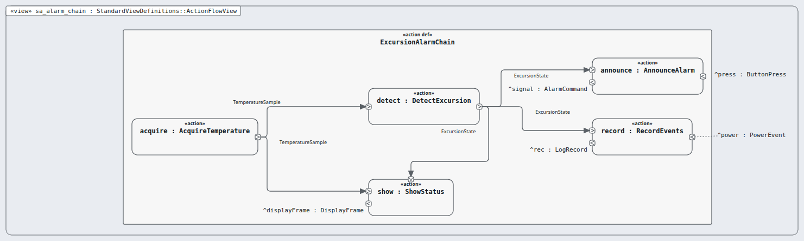

# System Analysis (SA) — layer 2 of 5

**Question this layer answers:** What must the device do, seen from outside as ONE box?

**Read in this order** (Arcadia viewpoints, drawn by Sanad's canvas, looked at):

| # | Picture | Arcadia viewpoint | What you see |
|---|---|---|---|
| 1 |  `sa_context.png` | System Architecture Blank (SAB) — context | The monitor as ONE box with its four actors and five boundary ports; its nine system functions listed inside. |
| 2 |  `sa_functions.png` | System Data Flow Blank (SDFB) | The nine system functions and what they hand each other (system data flow). |
| 3 |  `sa_alarm_chain.png` | Functional chain: excursion alarm | The excursion-alarm functional chain: acquire → detect → announce / show / record. Budget ≤ 5 s in the package doc (the picture cannot show time yet, run 2 F-123). |

**Requirements of this layer (62, system requirement):** MRTM-ENV-001 MRTM-ENV-002 MRTM-ENV-003 MRTM-ENV-004 MRTM-IFC-001 MRTM-IFC-002 MRTM-IFC-003 MRTM-IFC-004 MRTM-MNT-001 MRTM-MNT-002 MRTM-MNT-003 MRTM-PRF-001 MRTM-PRF-002 MRTM-PRF-003 MRTM-PRF-004 MRTM-SAF-001 MRTM-SAF-002 MRTM-SAF-003 MRTM-SAF-004 MRTM-SAF-005 MRTM-SAF-006 MRTM-SAF-007 MRTM-SAF-008 MRTM-SAF-009 MRTM-SAF-010 MRTM-SAF-011 MRTM-SAF-012 MRTM-SAF-013 MRTM-SAF-014 MRTM-SAF-015 MRTM-SAF-016 MRTM-SAF-017 MRTM-SAF-018 MRTM-SAF-019 MRTM-SAF-020 MRTM-SAF-021 MRTM-SAF-022 MRTM-SAF-023 MRTM-SYS-001 MRTM-SYS-002 MRTM-SYS-003 MRTM-SYS-004 MRTM-SYS-005 MRTM-SYS-006 MRTM-SYS-007 MRTM-SYS-008 MRTM-SYS-009 MRTM-SYS-010 MRTM-SYS-011 MRTM-SYS-012 MRTM-SYS-013 MRTM-SYS-014 MRTM-SYS-015 MRTM-SYS-016 MRTM-SYS-017 MRTM-SYS-018 MRTM-SYS-019 MRTM-SYS-020 MRTM-SYS-021 MRTM-SYS-022 MRTM-SYS-023 MRTM-SYS-024

**Model:** the `.sysml` files in this folder; `SaTrace.sysml` holds the satisfy lines (this layer's requirements only).
**Derived from:** layer OA.
**Goes down to:** [LA](../la/INDEX.md) through the transition table [`../transitions/sa-to-la.md`](../transitions/sa-to-la.md).
