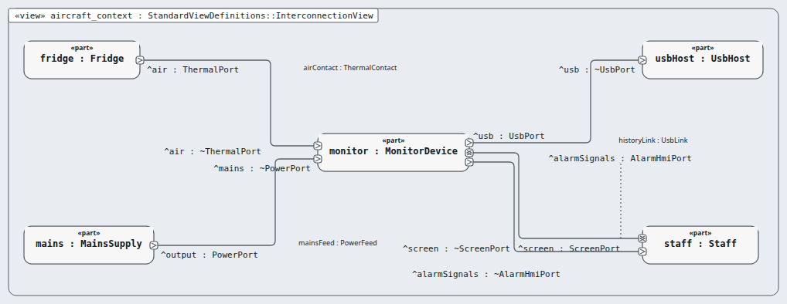
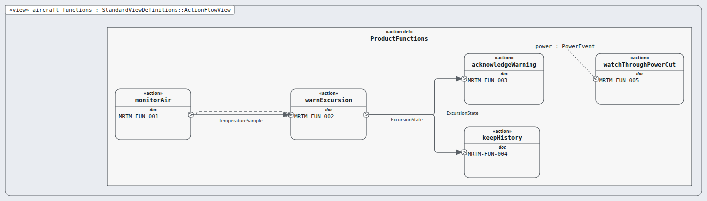

# aircraft — aircraft (rung: aircraft, DAL A)

**In one line:** the whole product and its needs, functions and FHA objectives.

- **Parent:** — (top) · **Children:** system
- **Requirements:** `03-requirements/aircraft/` (18) · **Model:** the `.sysml` files in this folder; the satisfy lines name this node's requirements only.

## Pictures, in reading order

1. `aircraft_context.png` — the monitor as one box among the fridge, the mains, the USB host and the staff  
   
2. `aircraft_functions.png` — the five product functions (MRTM-FUN-001…005) and what flows between them  
   

## Requirements

| Id | Title | DAL | |
|---|---|---|---|
| MRTM-FUN-001 | Monitor the fridge air | A |  |
| MRTM-FUN-002 | Warn of an excursion | A |  |
| MRTM-FUN-003 | Acknowledge the warning | A |  |
| MRTM-FUN-004 | Keep the history | C |  |
| MRTM-FUN-005 | Watch through a power cut | A |  |
| MRTM-SOB-001 | No silent loss of warning | A |  |
| MRTM-SOB-002 | No silent wrong band | A |  |
| MRTM-SOB-003 | Drift is bounded and shown | B |  |
| MRTM-SOB-004 | Nuisance warnings are limited | C |  |
| MRTM-SOB-005 | No silent loss of history | C |  |
| MRTM-STK-001 | Alert on excursion | A |  |
| MRTM-STK-002 | No alert on brief door opening | A |  |
| MRTM-STK-003 | Silence the alert | A |  |
| MRTM-STK-004 | See the temperature | A |  |
| MRTM-STK-005 | Audit history | C |  |
| MRTM-STK-006 | History cannot be edited | C |  |
| MRTM-STK-007 | Probe failure is visible | A |  |
| MRTM-STK-008 | Monitoring through a power cut | A |  |
