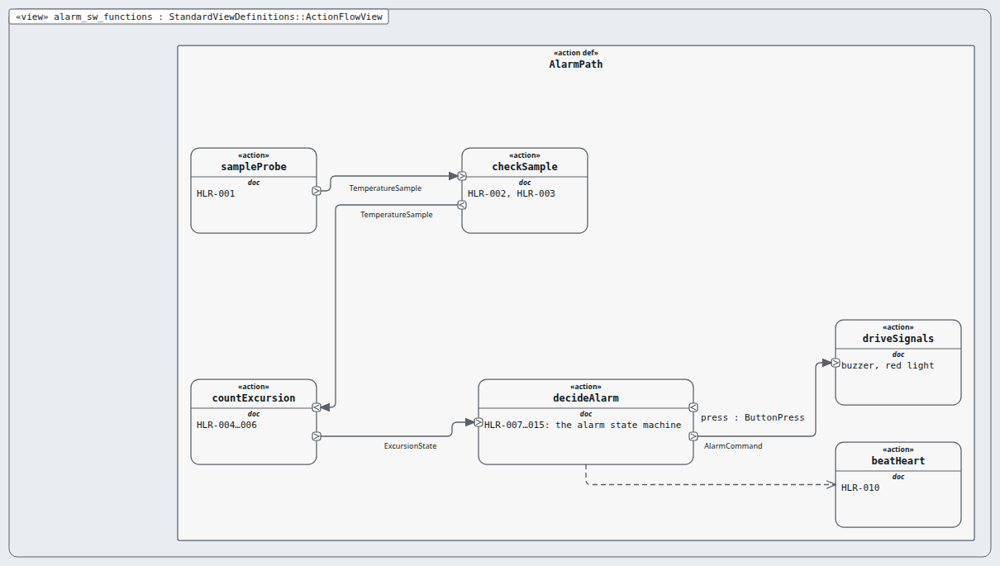

# alarm-sw — software item (rung: item, DAL A)

**In one line:** a software item: its HLR (DO-178C §5.1).

- **Parent:** system · **Children:** alarm-sw-design
- **Requirements:** `03-requirements/hlr/alarm-sw/` (16) · **Model:** the `.sysml` files in this folder; the `satisfy` lines name this node's requirements only.

## Pictures, in reading order

1. `alarm_sw_functions.png` — what the alarm software item does, in order, with the HLR each step answers  
   

## Requirements

| Id | Title | DAL | |
|---|---|---|---|
| MRTM-HLR-001 | Sample period and read | A |  |
| MRTM-HLR-002 | Invalid sample | A |  |
| MRTM-HLR-003 | Probe fault declaration | A |  |
| MRTM-HLR-004 | Early excursion report | A |  |
| MRTM-HLR-005 | Confirmed excursion report | A |  |
| MRTM-HLR-006 | Excursion end report | A |  |
| MRTM-HLR-007 | Early alarm light | A |  |
| MRTM-HLR-008 | Buzzer on | A |  |
| MRTM-HLR-009 | Buzzer off on acknowledge | A |  |
| MRTM-HLR-010 | Alarm heartbeat | A |  |
| MRTM-HLR-011 | Re-sound after silence | A |  |
| MRTM-HLR-012 | Probe fault tone | A |  |
| MRTM-HLR-013 | Buzzer fault | A |  |
| MRTM-HLR-014 | Alarm survives restart | A |  |
| MRTM-HLR-015 | Stuck button | A |  |
| MRTM-HLR-038 | Buzzer in fail-safe | A |  |
