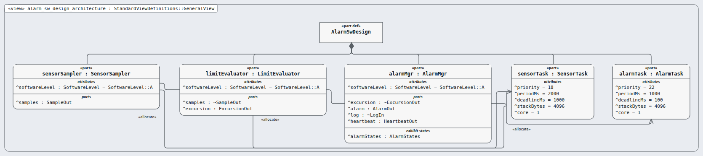
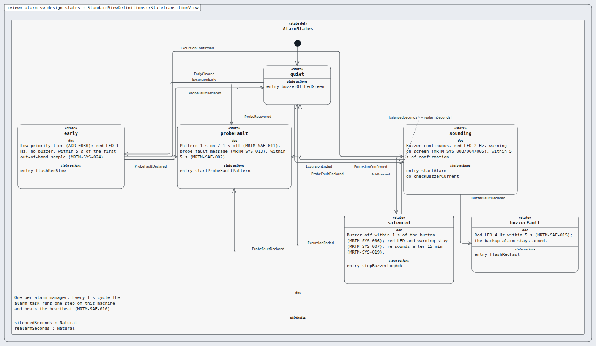

# alarm-sw-design — software design (rung: software-design, DAL A)

**In one line:** the software design of an item: architecture + LLR (DO-178C §5.2).

- **Parent:** alarm-sw · **Children:** — (leaf)
- **Requirements:** `03-requirements/llr/alarm-sw/` (16) · **Model:** the `.sysml` files in this folder; the `satisfy` lines name this node's requirements only.

## Pictures, in reading order

1. `alarm_sw_design_architecture.png` — the alarm software architecture: three components, two tasks, software levels (Sanad's profile)  
   
2. `alarm_sw_design_states.png` — the alarm state machine every 1 s cycle steps through  
   

## Requirements

| Id | Title | DAL | |
|---|---|---|---|
| MRTM-LLR-001 | Bus start | A |  |
| MRTM-LLR-002 | Unit conversion | A |  |
| MRTM-LLR-003 | Sample read | A |  |
| MRTM-LLR-004 | Probe fault flag | A |  |
| MRTM-LLR-005 | CRC-8 | A |  |
| MRTM-LLR-006 | Sensor step | A |  |
| MRTM-LLR-007 | Band set | A |  |
| MRTM-LLR-008 | Consecutive counts | A |  |
| MRTM-LLR-009 | Peak | A |  |
| MRTM-LLR-010 | State restore | A |  |
| MRTM-LLR-011 | Signal queue | A |  |
| MRTM-LLR-012 | Transition table | A |  |
| MRTM-LLR-013 | Outputs per state | A |  |
| MRTM-LLR-014 | Debounce timer | A |  |
| MRTM-LLR-015 | Accepted press | A |  |
| MRTM-LLR-016 | Heartbeat read | A |  |
