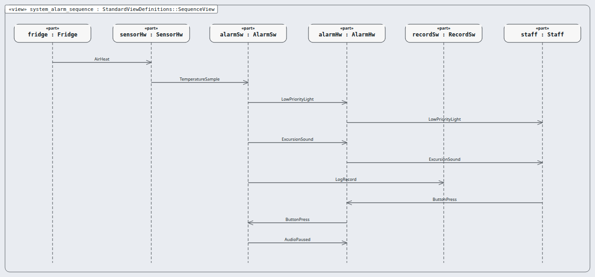
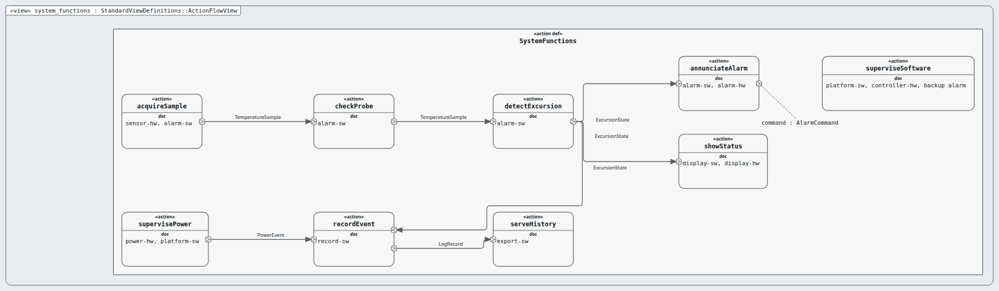
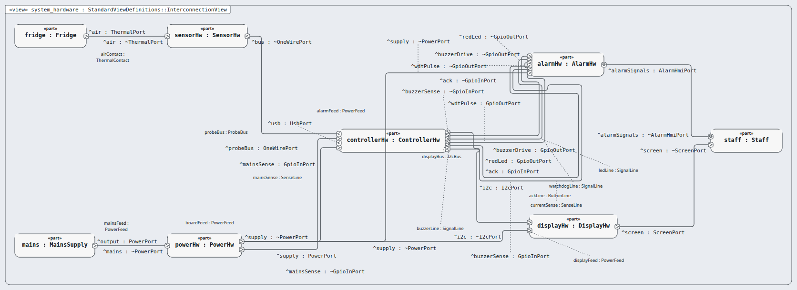
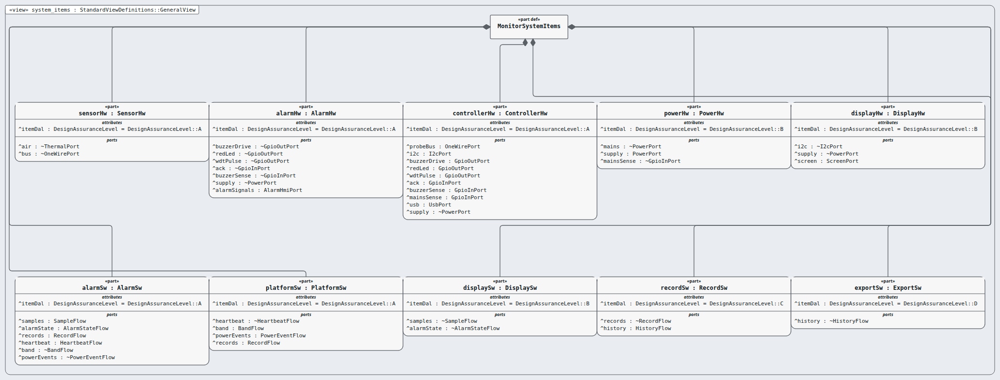
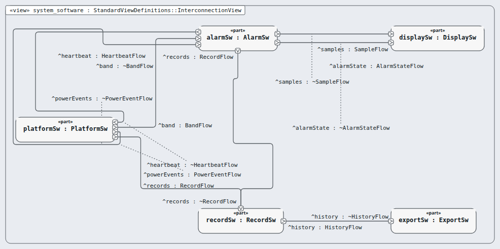

# system — system (rung: system, DAL A)

**In one line:** the monitoring system: requirements, functions, ten items.

- **Parent:** aircraft · **Children:** sensor-hw, alarm-hw, controller-hw, power-hw, display-hw, alarm-sw, platform-sw, display-sw, record-sw, export-sw
- **Requirements:** `03-requirements/system/` (62) · **Model:** the `.sysml` files in this folder; the `satisfy` lines name this node's requirements only.

## Pictures, in reading order

1. `system_alarm_sequence.png` — the alarm path at item level: warm air → early light → buzzer → log → acknowledge  
   
2. `system_functions.png` — the nine system functions, each tagged with the items that perform it  
   
3. `system_hardware.png` — hardware item interconnection: buses, lines and power feeds  
   
4. `system_items.png` — the ten items as one tree, each with its DAL  
   
5. `system_software.png` — software item interconnection: the flows between the five software items  
   

## Requirements

| Id | Title | DAL | |
|---|---|---|---|
| MRTM-ENV-001 | Battery endurance | A |  |
| MRTM-ENV-002 | Ambient temperature | A |  |
| MRTM-ENV-003 | Humidity | A |  |
| MRTM-ENV-004 | Probe environment | A |  |
| MRTM-IFC-001 | Probe bus | A |  |
| MRTM-IFC-002 | Acknowledge input | A |  |
| MRTM-IFC-003 | USB readout | C |  |
| MRTM-IFC-004 | Display character height | A |  |
| MRTM-MNT-001 | Probe replacement | A |  |
| MRTM-MNT-002 | Battery level | A |  |
| MRTM-MNT-003 | Firmware version | A |  |
| MRTM-PRF-001 | Measurement accuracy | A |  |
| MRTM-PRF-002 | End-to-end alert time | A |  |
| MRTM-PRF-003 | Log readout time | C |  |
| MRTM-PRF-004 | Display refresh | A |  |
| MRTM-SAF-001 | Buzzer loudness | A |  |
| MRTM-SAF-002 | Probe fault raises alert | A |  |
| MRTM-SAF-003 | Implausible sample | A |  |
| MRTM-SAF-004 | Watchdog restart | A |  |
| MRTM-SAF-005 | Log power loss | A |  |
| MRTM-SAF-006 | Alert survives restart | A |  |
| MRTM-SAF-007 | Buzzer self-test | A |  |
| MRTM-SAF-008 | Low battery alarm | A |  |
| MRTM-SAF-009 | Backup alarm on firmware silence | A |  |
| MRTM-SAF-010 | Watchdog tied to the alarm service | A |  |
| MRTM-SAF-011 | Fault tone differs from excursion tone | C |  |
| MRTM-SAF-012 | Probe calibration due | B |  |
| MRTM-SAF-013 | Alarm on total power loss | A |  |
| MRTM-SAF-014 | Buzzer open-circuit detection | A |  |
| MRTM-SAF-015 | Diverse signal for buzzer fault | A |  |
| MRTM-SAF-016 | Show the band at power-up | B |  |
| MRTM-SAF-017 | Band integrity check | A |  |
| MRTM-SAF-018 | Two copies of every record | C |  |
| MRTM-SAF-019 | Stuck acknowledge button | A |  |
| MRTM-SAF-020 | Probe placement in the instructions | A |  |
| MRTM-SAF-021 | I2C bus recovery | B |  |
| MRTM-SAF-022 | Clock stop detection | C |  |
| MRTM-SAF-023 | Backup alarm power-up test | A |  |
| MRTM-SYS-001 | Sampling period | A |  |
| MRTM-SYS-002 | Excursion confirmation | A |  |
| MRTM-SYS-003 | Buzzer on excursion | A |  |
| MRTM-SYS-004 | Red indicator on excursion | A |  |
| MRTM-SYS-005 | Warning on excursion | A |  |
| MRTM-SYS-006 | Acknowledge silences buzzer | A |  |
| MRTM-SYS-007 | Warning stays while excursion is open | A |  |
| MRTM-SYS-008 | Log excursion start | C |  |
| MRTM-SYS-009 | Log excursion end | C |  |
| MRTM-SYS-010 | Log acknowledgement | C |  |
| MRTM-SYS-011 | Display resolution | A |  |
| MRTM-SYS-012 | Probe fault detection | A |  |
| MRTM-SYS-013 | Probe fault message | A |  |
| MRTM-SYS-014 | Read-only event log | C |  |
| MRTM-SYS-015 | Event log capacity | C |  |
| MRTM-SYS-016 | Battery operation | A |  |
| MRTM-SYS-017 | Allowed band | A |  |
| MRTM-SYS-018 | Excursion end confirmation | A |  |
| MRTM-SYS-019 | Alarm comes back after silence | A |  |
| MRTM-SYS-020 | Clock drift | C |  |
| MRTM-SYS-021 | Event log integrity | C |  |
| MRTM-SYS-022 | Log capacity warning | C |  |
| MRTM-SYS-023 | Power restore event | A |  |
| MRTM-SYS-024 | Early excursion alarm | A |  |
