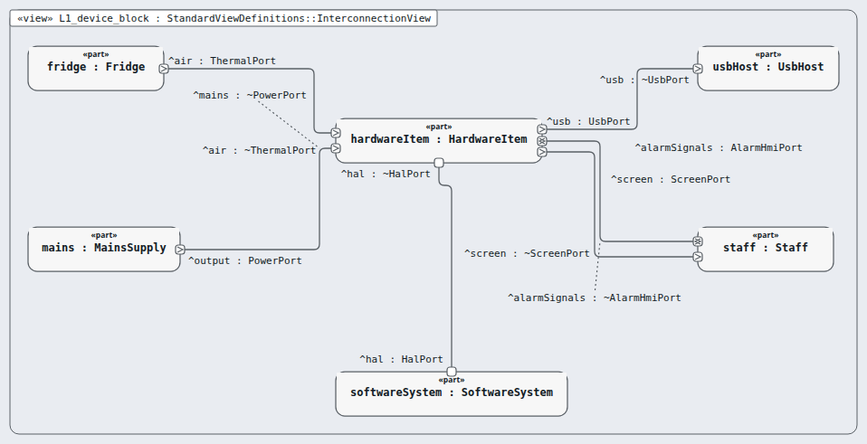
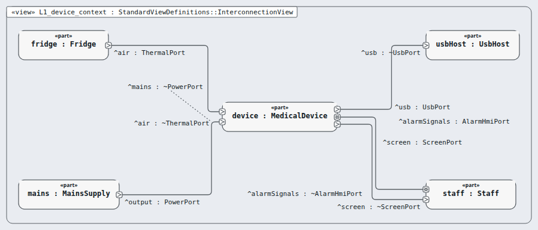
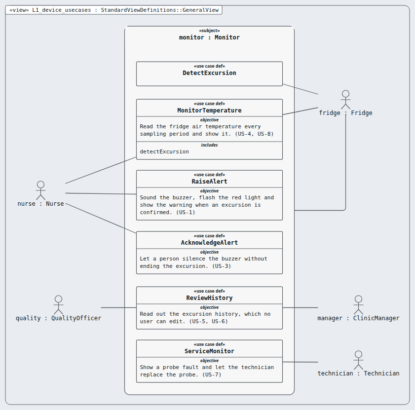

# Level 1 — device (device)

**In one line:** the medical device: intended use, device (system) requirements, risk management file — this page is the review packet for `device`.

| Field | Value |
|---|---|
| Level | 1 of 4 (pinned, IEC 62304) |
| Parent | — (top) |
| Children | hardware-item, software-system |
| IEC 62304 class | C |
| Model | `NodeDevice.sysml` (satisfies this node's requirements only) |

## Pictures (reading order)

| Picture | Grade | What it shows |
|---|---|---|
|  `L1_device_block` | B | hardware item + software system joined by ONE bundled HAL port; outside wires to the neighbours |
|  `L1_device_context` | B | the device as one box with fridge, mains, USB host, staff; port labels sit beside, not on, their ports (F-119) |
|  `L1_device_usecases` | B | six use cases, five actors; subject still named 'monitor' from the library |

## Requirements (70)

| Id | Derived from | Statement |
|---|---|---|
| MRTM-ENV-001 | MRTM-SYS-016 | The monitor shall operate from the internal battery for 4 h. |
| MRTM-ENV-002 | MRTM-SYS-001 | The monitor shall operate at an ambient temperature from 10 °C to 35 °C. |
| MRTM-ENV-003 | MRTM-SYS-001 | The monitor shall operate at a relative humidity from 15 % to 85 % non-condensing. |
| MRTM-ENV-004 | MRTM-SYS-001 | The temperature probe shall operate at a fridge air temperature from -30 °C to 50 °C. |
| MRTM-IFC-001 | MRTM-SYS-001 | The monitor shall read the temperature probe over a 1-Wire bus. |
| MRTM-IFC-002 | MRTM-SYS-006 | The monitor shall debounce the acknowledge button input for 50 ms. |
| MRTM-IFC-003 | MRTM-SYS-014 | The monitor shall present the event log to the USB host as a read-only mass-storage volume. |
| MRTM-IFC-004 | MRTM-SYS-005 | The monitor shall draw the temperature digits at a character height of 5 mm or more. |
| MRTM-MNT-001 | MRTM-SYS-012 | The monitor shall meet the measurement accuracy with a replacement temperature probe without recalibration. |
| MRTM-MNT-002 | MRTM-SYS-016 | The monitor shall show the battery charge level on the display in steps of 10 %. |
| MRTM-MNT-003 | MRTM-SYS-001 | The monitor shall show the firmware version on the display for 3 s at power-up. |
| MRTM-PRF-001 | MRTM-SYS-001 | The monitor shall measure the fridge air temperature with an accuracy of ±0.5 °C over the range 0 °C to 15 °C. |
| MRTM-PRF-002 | MRTM-SYS-003 | The monitor shall sound the buzzer within 65 s of the first sample outside the allowed band. |
| MRTM-PRF-003 | MRTM-SYS-015 | The monitor shall deliver the complete event log to the USB host within 30 s. |
| MRTM-PRF-004 | MRTM-SYS-011 | The monitor shall refresh the displayed temperature at a period of 10 s. |
| MRTM-SAF-001 | MRTM-SYS-003 | The monitor shall sound the buzzer at a sound pressure level of 65 dB(A) or more at 1 m. |
| MRTM-SAF-002 | MRTM-SYS-012 | The monitor shall sound the buzzer within 5 s of the probe fault declaration. |
| MRTM-SAF-003 | MRTM-SYS-001 | The monitor shall declare the probe fault when a sample falls outside the range -30 °C to 50 °C. |
| MRTM-SAF-004 | MRTM-SYS-001 | The monitor shall restart the monitoring software within 2 s of a software watchdog timeout. |
| MRTM-SAF-005 | MRTM-SYS-016 | The monitor shall log the power loss event within 1 s of mains power loss. |
| MRTM-SAF-006 | MRTM-SYS-003 | The monitor shall restore the unacknowledged alert state within 2 s of the restart. |
| MRTM-SAF-007 | MRTM-SYS-003 | The monitor shall test the buzzer within 5 s of power-up. |
| MRTM-SAF-008 | MRTM-SYS-016 | The monitor shall sound the buzzer within 5 s of the battery voltage falling below 3.4 V. |
| MRTM-SAF-009 | MRTM-SYS-003 | The backup alarm circuit shall sound the buzzer within 10 s of the last watchdog service pulse from the firmware. |
| MRTM-SAF-010 | MRTM-SYS-003 | The monitor shall stop the watchdog service pulses within 2 s of the alarm service missing its 1 s cycle. |
| MRTM-SAF-011 | MRTM-SYS-012 | The monitor shall sound the probe fault alarm as a buzzer pattern of 1 s on and 1 s off. |
| MRTM-SAF-012 | MRTM-SYS-001 | The monitor shall show the probe calibration due message on the display 365 days after the probe calibration date. |
| MRTM-SAF-013 | MRTM-SYS-016 | The backup alarm circuit shall sound the buzzer for 60 s or more after the loss of both mains and battery power. |
| MRTM-SAF-014 | MRTM-SYS-003 | The monitor shall declare the buzzer fault within 5 s of the buzzer drive current falling below 5 mA while the monitor drives the buzzer. |
| MRTM-SAF-015 | MRTM-SYS-004 | The monitor shall flash the red indicator at 4 Hz within 5 s of the buzzer fault declaration. |
| MRTM-SAF-016 | MRTM-SYS-017 | The monitor shall show the allowed band limits on the display for 3 s at power-up. |
| MRTM-SAF-017 | MRTM-SYS-017 | The monitor shall sound the buzzer within 5 s of power-up when the stored allowed band fails its CRC-32 check. |
| MRTM-SAF-018 | MRTM-SYS-015 | The monitor shall write the event log record to 2 separate flash sectors within 1 s of the event. |
| MRTM-SAF-019 | MRTM-SYS-006 | The monitor shall declare the button fault when the acknowledge button input stays pressed for 60 s. |
| MRTM-SAF-020 | MRTM-SYS-001 | The instructions for use shall state the probe position as the middle of the fridge air space, 5 cm or more from the fridge walls. |
| MRTM-SAF-021 | MRTM-SYS-005 | The monitor shall reset the I2C bus within 1 s of an I2C transaction timeout. |
| MRTM-SAF-022 | MRTM-SYS-020 | The monitor shall log the clock fault event within 2 s of power-up when the real-time clock reports an oscillator stop. |
| MRTM-SAF-023 | MRTM-SYS-003 | The monitor shall test the backup alarm within 15 s of power-up. |
| MRTM-STK-001 | — | The monitor shall alert the nurse at the fridge when the fridge air temperature leaves the allowed band. |
| MRTM-STK-002 | — | The monitor shall raise no audible alert for the temperature departure shorter than the excursion confirmation time. |
| MRTM-STK-003 | — | The monitor shall let the nurse silence the alert. |
| MRTM-STK-004 | — | The monitor shall display the current fridge air temperature to the nurse. |
| MRTM-STK-005 | — | The monitor shall give the clinic manager the excursion history for audit. |
| MRTM-STK-006 | — | The monitor shall protect the excursion history from change by the user. |
| MRTM-STK-007 | — | The monitor shall tell the technician when the temperature probe fails. |
| MRTM-STK-008 | — | The monitor shall keep monitoring during a mains power loss of up to 4 h. |
| MRTM-SYS-001 | MRTM-STK-004 | The monitor shall sample the fridge air temperature at the sampling period of 2 s. |
| MRTM-SYS-002 | MRTM-STK-002 | The monitor shall confirm the excursion when 31 consecutive samples, spanning 60 s, are outside the allowed band. |
| MRTM-SYS-003 | MRTM-STK-001 | The monitor shall sound the buzzer within 5 s of excursion confirmation. |
| MRTM-SYS-004 | MRTM-STK-001 | The monitor shall flash the red indicator at 2 Hz within 5 s of excursion confirmation. |
| MRTM-SYS-005 | MRTM-STK-001 | The monitor shall show the excursion warning on the display within 5 s of excursion confirmation. |
| MRTM-SYS-006 | MRTM-STK-003 | The monitor shall stop the buzzer within 1 s of the acknowledge button press. |
| MRTM-SYS-007 | MRTM-STK-003 | The monitor shall keep the excursion warning on the display for the duration of the excursion. |
| MRTM-SYS-008 | MRTM-STK-005 | The monitor shall log the excursion start event with the UTC time stamp at 1 s resolution. |
| MRTM-SYS-009 | MRTM-STK-005 | The monitor shall log the excursion end event with the peak temperature of the excursion at 0.1 °C resolution. |
| MRTM-SYS-010 | MRTM-STK-005 | The monitor shall log the acknowledgement event with the UTC time stamp at 1 s resolution. |
| MRTM-SYS-011 | MRTM-STK-004 | The monitor shall display the current temperature at 0.1 °C resolution. |
| MRTM-SYS-012 | MRTM-STK-007 | The monitor shall declare the probe fault when no sample with a correct CRC arrives for 30 s. |
| MRTM-SYS-013 | MRTM-STK-007 | The monitor shall show the probe fault message on the display within 5 s of the probe fault declaration. |
| MRTM-SYS-014 | MRTM-STK-006 | The monitor shall restrict the user access to the event log to read-only. |
| MRTM-SYS-015 | MRTM-STK-005 | The monitor shall retain 10000 events in the event log. |
| MRTM-SYS-016 | MRTM-STK-008 | The monitor shall switch to the internal battery within 100 ms of mains power loss. |
| MRTM-SYS-017 | MRTM-STK-001 | The monitor shall use the allowed band from 2 °C to 8 °C. |
| MRTM-SYS-018 | MRTM-STK-002 | The monitor shall end the excursion after 31 consecutive samples, spanning 60 s, back inside the allowed band. |
| MRTM-SYS-019 | MRTM-STK-003 | The monitor shall sound the buzzer again 15 min after the acknowledge button press while the excursion continues. |
| MRTM-SYS-020 | MRTM-STK-005 | The monitor shall keep the UTC time with a drift of 2 s per day or less. |
| MRTM-SYS-021 | MRTM-STK-006 | The monitor shall report a corrupted event log record within 1 s of reading it, using its CRC-32 checksum. |
| MRTM-SYS-022 | MRTM-STK-005 | The monitor shall show the log capacity warning on the display when the event log holds 9000 events. |
| MRTM-SYS-023 | MRTM-STK-008 | The monitor shall log the power restore event with the UTC time stamp at 1 s resolution. |
| MRTM-SYS-024 | MRTM-STK-001 | The system shall raise an alarm within 5 seconds of a temperature excursion. |

DRAFT — needs Masood's review. Generated by tools/pinned-index.py.
