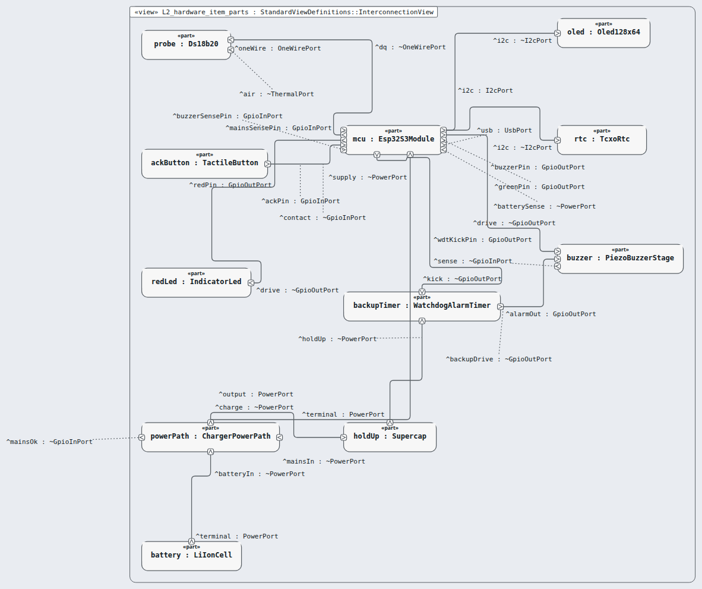

# Level 2 — hardware-item (hardware item)

**In one line:** the hardware side of the device, as one item — this page is the review packet for `hardware-item`.

| Field | Value |
|---|---|
| Level | 2 of 4 (pinned, IEC 62304) |
| Parent | device |
| Children | — (code and tests below) |
| IEC 62304 class | C |
| Model | `NodeHardwareItem.sysml` (satisfies this node's requirements only) |

## Pictures (reading order)

| Picture | Grade | What it shows |
|---|---|---|
|  `L2_hardware_item_parts` | C | 11 chosen parts and their wires; unused pins float as labels (F-119) |

## Requirements (13)

| Id | Derived from | Statement |
|---|---|---|
| MRTM-HWI-001 | MRTM-SYS-024 | The hardware item shall complete a 12-bit temperature conversion within 750 ms. |
| MRTM-HWI-002 | MRTM-PRF-001, MRTM-ENV-004 | The hardware item shall measure the fridge air temperature with an accuracy of ±0.5 °C over the range 0 °C to 15 °C. |
| MRTM-HWI-003 | MRTM-SYS-012, MRTM-SAF-003 | When the software reads the probe scratchpad, the hardware item shall send a CRC-8 value with the **Sample** data. |
| MRTM-HWI-004 | MRTM-SAF-001 | The hardware item shall produce a sound pressure level of 65 dB(A) or more at 1 m when either buzzer drive input is active. |
| MRTM-HWI-005 | MRTM-SYS-004 | The hardware item shall light the red indicator within 10 ms of its drive input. |
| MRTM-HWI-006 | MRTM-SYS-006, MRTM-IFC-002 | While a clinic staff member presses the acknowledge button, the hardware item shall close the contact that signals an **Acknowledgement**. |
| MRTM-HWI-007 | MRTM-SAF-009 | The hardware item shall drive the buzzer from the backup alarm within 10 s of the last watchdog service pulse. |
| MRTM-HWI-008 | MRTM-SAF-013 | The hardware item shall drive the buzzer from the backup alarm for 60 s or more after the loss of both mains and battery power. |
| MRTM-HWI-009 | MRTM-IFC-004 | The hardware item shall draw the temperature digits at a character height of 5 mm or more. |
| MRTM-HWI-010 | MRTM-SYS-020 | The hardware item shall keep time with a drift of 2 s per day or less from 10 °C to 35 °C. |
| MRTM-HWI-011 | MRTM-SYS-016 | The hardware item shall switch the load from mains to battery within 100 ms of mains power loss. |
| MRTM-HWI-012 | MRTM-ENV-001 | The hardware item shall supply the monitor from the battery for 4 h. |
| MRTM-HWI-013 | MRTM-SAF-004 | The hardware item shall reset the processor within 1 s of its hardware watchdog expiry. |

DRAFT — needs Masood's review. Generated by tools/pinned-index.py.
