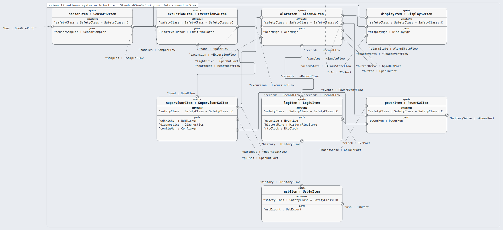
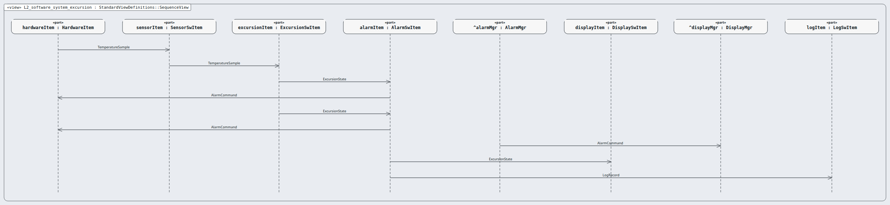
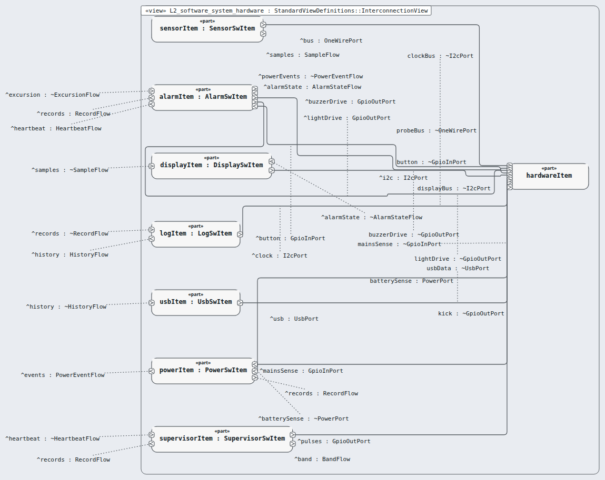
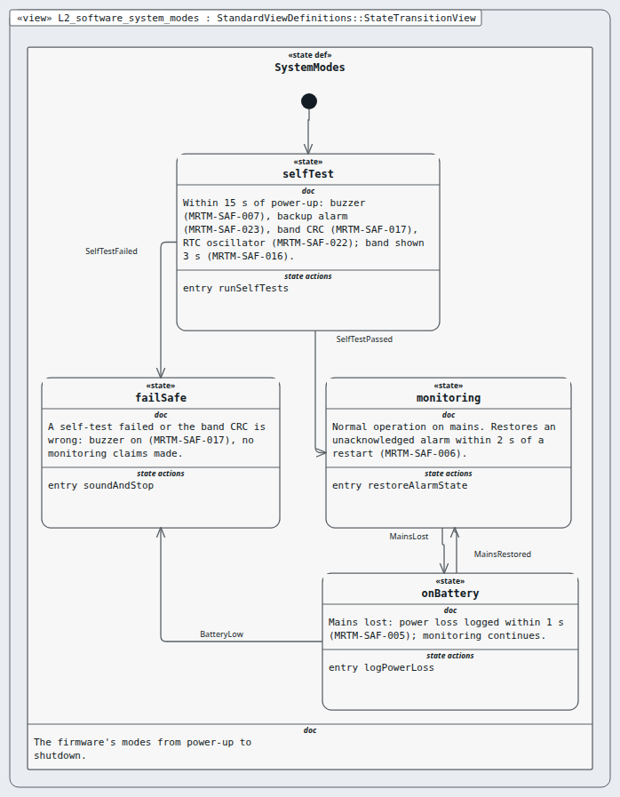

# Level 2 — software-system (software system)

**In one line:** the software requirements specification (SRS) and the architecture: items and their interfaces — this page is the review packet for `software-system`.

| Field | Value |
|---|---|
| Level | 2 of 4 (pinned, IEC 62304) |
| Parent | device |
| Children | sensor-item, excursion-item, alarm-item, display-item, log-item, usb-item, power-item, supervisor-item |
| IEC 62304 class | C |
| Model | `NodeSoftwareSystem.sysml` (satisfies this node's requirements only) |

## Pictures (reading order)

| Picture | Grade | What it shows |
|---|---|---|
|  `L2_software_system_architecture` | C | 8 items, class per item (usbItem = B) and units in compartments; 11 flows readable, but labels float and wires cross |
|  `L2_software_system_excursion` | C | item-level excursion scenario reads left to right; the canvas adds two lifelines and one message from another package (F-5-004) |
|  `L2_software_system_hardware` | D | which item drives which hardware signal; every unused item port is drawn as a floating label (F-119) — hard to read |
|  `L2_software_system_modes` | A | power-up, self-test, monitoring, battery, fail-safe; clean |

## Requirements (19)

| Id | Derived from | Statement |
|---|---|---|
| MRTM-SRS-001 | MRTM-SYS-001 | The software system shall read one fridge air temperature sample from the probe at a period of 2 s. |
| MRTM-SRS-002 | MRTM-SYS-024 | The software system shall command the low-priority excursion alarm signal within 1 s of the first valid out-of-band sample. |
| MRTM-SRS-003 | MRTM-SYS-002 | The software system shall confirm the excursion when 31 consecutive valid samples, spanning 60 s, are outside the allowed band. |
| MRTM-SRS-004 | MRTM-SYS-018 | The software system shall end the excursion after 31 consecutive valid samples, spanning 60 s, inside the allowed band. |
| MRTM-SRS-005 | MRTM-SYS-012, MRTM-SAF-003 | The software system shall mark a sample invalid when its CRC-8 check fails or its value is outside -30 °C to 50 °C. |
| MRTM-SRS-006 | MRTM-SYS-003, MRTM-PRF-002 | The software system shall switch the buzzer drive on within 1 s of excursion confirmation. |
| MRTM-SRS-007 | MRTM-SYS-006, MRTM-IFC-002 | The software system shall switch the buzzer drive off within 1 s of a debounced acknowledge press. |
| MRTM-SRS-008 | MRTM-SYS-003 | The software system shall drive the confirmed excursion alarm sound as bursts of 10 pulses with a burst repetition interval from 2.5 s to 15 s. |
| MRTM-SRS-009 | MRTM-SYS-005, MRTM-SYS-007 | The software system shall show the excursion warning within 1 s of excursion confirmation until the excursion ends. |
| MRTM-SRS-010 | MRTM-SYS-011, MRTM-PRF-004 | The software system shall show the current temperature at 0.1 °C resolution, refreshed at a period of 10 s. |
| MRTM-SRS-011 | MRTM-SYS-013, MRTM-SAF-012, MRTM-SAF-016, MRTM-SYS-022 | The software system shall show the probe fault, calibration due, band limits and log capacity messages within 1 s of their cause. |
| MRTM-SRS-012 | MRTM-SAF-018, MRTM-SYS-008, MRTM-SYS-009, MRTM-SYS-010 | The software system shall store each event record in 2 separate flash sectors within 1 s of the event. |
| MRTM-SRS-013 | MRTM-SYS-015 | When the **Event Log** reaches its capacity, the software system shall keep the newest 10000 records in the **Event Log**. |
| MRTM-SRS-014 | MRTM-SYS-014, MRTM-IFC-003, MRTM-PRF-003 | The software system shall give the USB host read-only access to the event records within 30 s of connection. |
| MRTM-SRS-015 | MRTM-SYS-020, MRTM-SYS-008, MRTM-SAF-022 | The software system shall time-stamp each record with UTC at 1 s resolution. |
| MRTM-SRS-016 | MRTM-SAF-005, MRTM-SAF-008, MRTM-SYS-023 | The software system shall report mains loss, mains restore and battery voltage below 3.4 V within 1 s. |
| MRTM-SRS-017 | MRTM-SAF-010, MRTM-SAF-009 | The software system shall stop the watchdog service pulses within 2 s of the alarm function missing its 1 s cycle. |
| MRTM-SRS-018 | MRTM-SAF-007, MRTM-SAF-023 | The software system shall test the buzzer within 5 s and the backup alarm within 15 s of power-up. |
| MRTM-SRS-019 | MRTM-SAF-017, MRTM-SYS-017 | When a stored allowed band fails its CRC-32 check, the software system shall disable that **Allowed Band**. |

DRAFT — needs Masood's review. Generated by tools/pinned-index.py.
