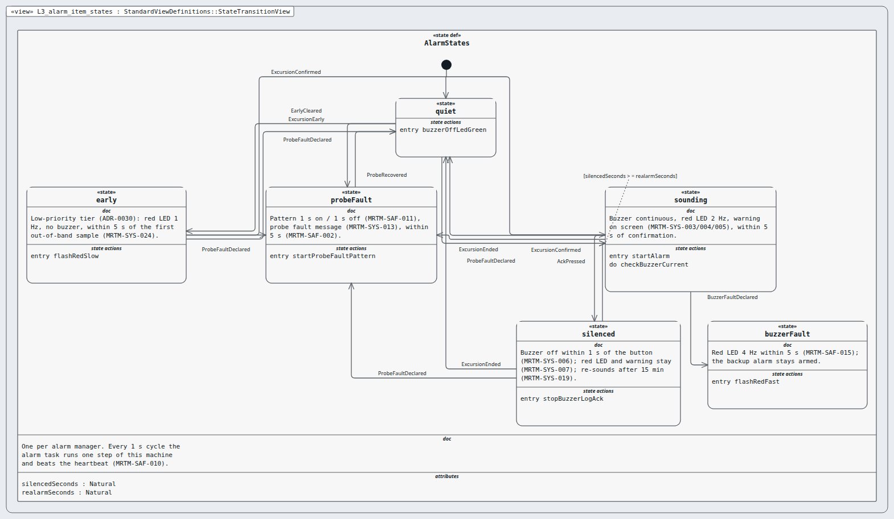
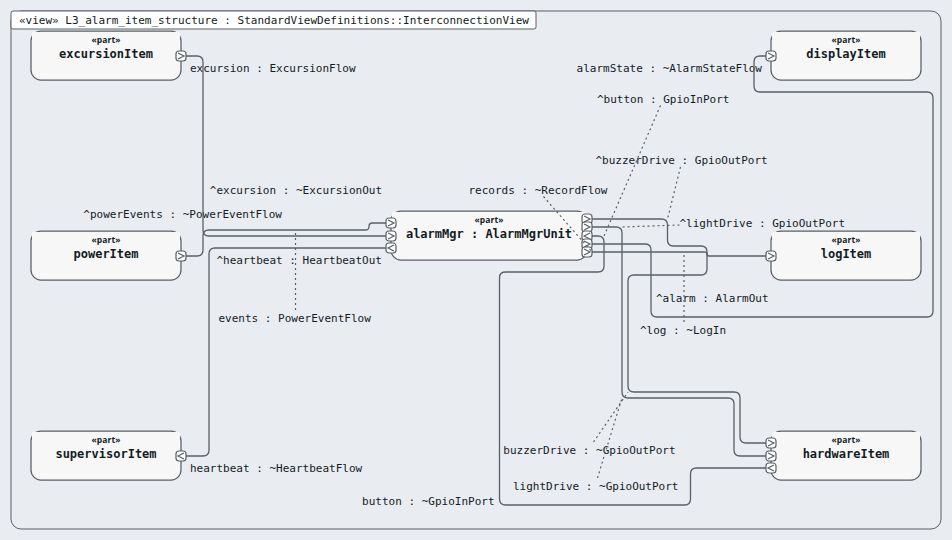

# Level 3 — alarm-item (software item)

**In one line:** one item per box of the architecture, its own class, and segregation where it is lower than C — this page is the review packet for `alarm-item`.

| Field | Value |
|---|---|
| Level | 3 of 4 (pinned, IEC 62304) |
| Parent | software-system |
| Children | alarm-mgr |
| IEC 62304 class | C |
| Model | `NodeAlarmItem.sysml` (satisfies this node's requirements only) |

## Pictures (reading order)

| Picture | Grade | What it shows |
|---|---|---|
|  `L3_alarm_item_states` | B | the alarm state machine; parallel transition labels stack (run 2 F-121) |
|  `L3_alarm_item_structure` | C | unit alarmMgr with 8 wires; readable but crowded, labels float |

## Requirements (4)

| Id | Derived from | Statement |
|---|---|---|
| MRTM-ALI-001 | MRTM-SRS-002 | The alarm item shall flash the red indicator at 1 Hz within one 1 s alarm cycle of the early excursion report. |
| MRTM-ALI-002 | MRTM-SRS-006 | The alarm item shall switch the buzzer drive on within one 1 s alarm cycle of the confirmed excursion report. |
| MRTM-ALI-003 | MRTM-SRS-007 | The alarm item shall switch the buzzer drive off within one 1 s alarm cycle of a debounced acknowledge press. |
| MRTM-ALI-004 | MRTM-SRS-017 | The alarm item shall advance its heartbeat counter once per 1 s alarm cycle. |

DRAFT — needs Masood's review. Generated by tools/pinned-index.py.
