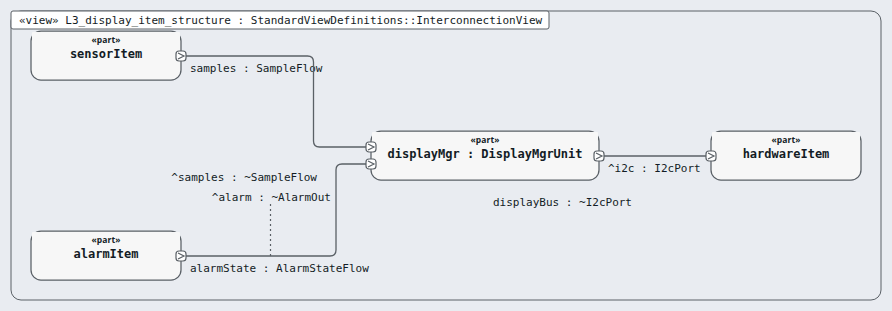

# Level 3 — display-item (software item)

**In one line:** one item per box of the architecture, its own class, and segregation where it is lower than C — this page is the review packet for `display-item`.

| Field | Value |
|---|---|
| Level | 3 of 4 (pinned, IEC 62304) |
| Parent | software-system |
| Children | display-mgr |
| IEC 62304 class | C |
| Model | `NodeDisplayItem.sysml` (satisfies this node's requirements only) |

## Pictures (reading order)

| Picture | Grade | What it shows |
|---|---|---|
|  `L3_display_item_structure` | B | unit displayMgr: samples + alarm state in, I2C out |

## Requirements (2)

| Id | Derived from | Statement |
|---|---|---|
| MRTM-DSI-001 | MRTM-SRS-009, MRTM-SRS-011 | The display item shall redraw the frame within 1 s of a state change message. |
| MRTM-DSI-002 | MRTM-SRS-010 | The display item shall change the displayed temperature at most once per 10 s, at 0.1 °C resolution. |

DRAFT — needs Masood's review. Generated by tools/pinned-index.py.
