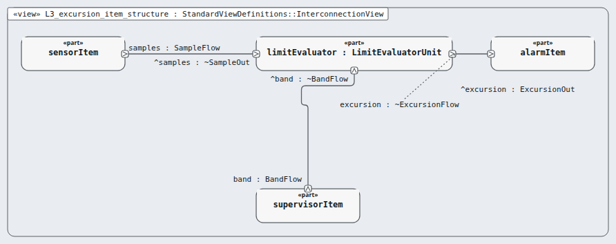

# Level 3 — excursion-item (software item)

**In one line:** one item per box of the architecture, its own class, and segregation where it is lower than C — this page is the review packet for `excursion-item`.

| Field | Value |
|---|---|
| Level | 3 of 4 (pinned, IEC 62304) |
| Parent | software-system |
| Children | limit-evaluator |
| IEC 62304 class | C |
| Model | `NodeExcursionItem.sysml` (satisfies this node's requirements only) |

## Pictures (reading order)

| Picture | Grade | What it shows |
|---|---|---|
|  `L3_excursion_item_structure` | B | unit limitEvaluator: samples in, excursion out, band from the supervisor item |

## Requirements (3)

| Id | Derived from | Statement |
|---|---|---|
| MRTM-EXI-001 | MRTM-SRS-002 | The excursion item shall report the early excursion within the 2 s sample period of the first valid sample outside the allowed band. |
| MRTM-EXI-002 | MRTM-SRS-003 | The excursion item shall report the confirmed excursion at the 31st consecutive valid sample outside the allowed band, 60 s after the first of them. |
| MRTM-EXI-003 | MRTM-SRS-004 | The excursion item shall report the excursion end at the 31st consecutive valid sample inside the allowed band, 60 s after the first of them. |

DRAFT — needs Masood's review. Generated by tools/pinned-index.py.
