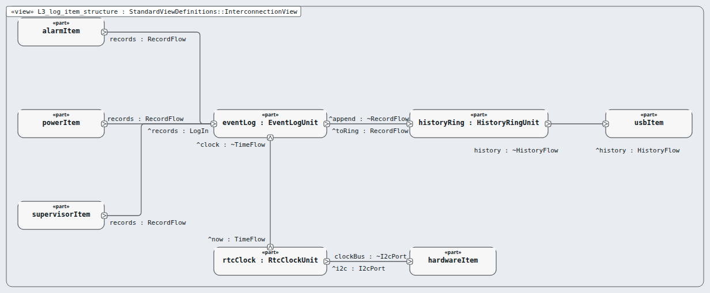

# Level 3 — log-item (software item)

**In one line:** one item per box of the architecture, its own class, and segregation where it is lower than C — this page is the review packet for `log-item`.

| Field | Value |
|---|---|
| Level | 3 of 4 (pinned, IEC 62304) |
| Parent | software-system |
| Children | event-log, history-ring, rtc-clock |
| IEC 62304 class | C |
| Model | `NodeLogItem.sysml` (satisfies this node's requirements only) |

## Pictures (reading order)

| Picture | Grade | What it shows |
|---|---|---|
|  `L3_log_item_structure` | B | three units: eventLog -> historyRing -> USB item; rtcClock gives the time |

## Requirements (3)

| Id | Derived from | Statement |
|---|---|---|
| MRTM-LGI-001 | MRTM-SRS-012 | The log item shall write each record with its CRC-32 to 2 separate flash sectors within 1 s of the event. |
| MRTM-LGI-002 | MRTM-SRS-013 | When the **Event Log** holds 10000 records, the log item shall write each new **Event Record** over the oldest one. |
| MRTM-LGI-003 | MRTM-SRS-015 | The log item shall stamp each record with the UTC second of the real-time clock at the time of the event. |

DRAFT — needs Masood's review. Generated by tools/pinned-index.py.
