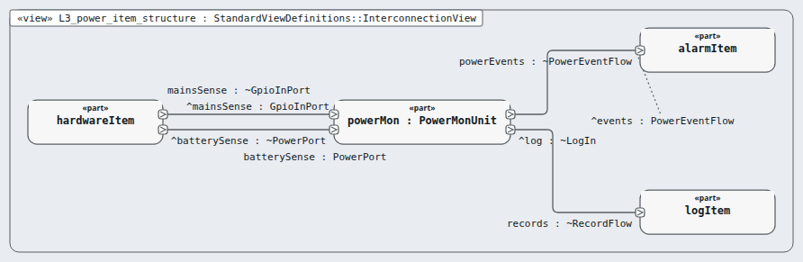

# Level 3 — power-item (software item)

**In one line:** one item per box of the architecture, its own class, and segregation where it is lower than C — this page is the review packet for `power-item`.

| Field | Value |
|---|---|
| Level | 3 of 4 (pinned, IEC 62304) |
| Parent | software-system |
| Children | power-mon |
| IEC 62304 class | C |
| Model | `NodePowerItem.sysml` (satisfies this node's requirements only) |

## Pictures (reading order)

| Picture | Grade | What it shows |
|---|---|---|
|  `L3_power_item_structure` | B | unit powerMon: mains sense and battery in, events and records out |

## Requirements (2)

| Id | Derived from | Statement |
|---|---|---|
| MRTM-PWI-001 | MRTM-SRS-016 | The power item shall post the mains-lost and mains-restored signals within 1 s of the mains sense edge. |
| MRTM-PWI-002 | MRTM-SRS-016 | The power item shall post the battery-low signal after 2 consecutive battery readings below 3.4 V. |

DRAFT — needs Masood's review. Generated by tools/pinned-index.py.
