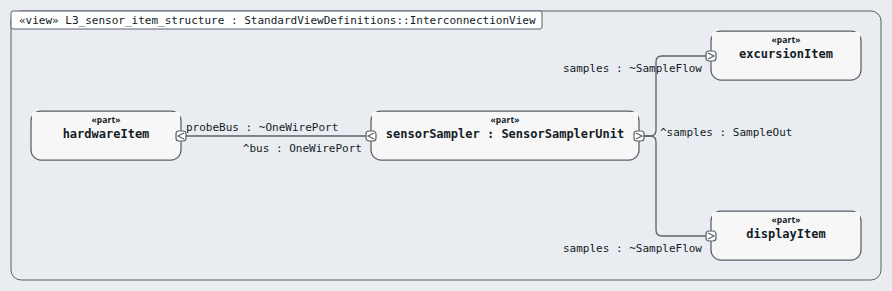

# Level 3 — sensor-item (software item)

**In one line:** one item per box of the architecture, its own class, and segregation where it is lower than C — this page is the review packet for `sensor-item`.

| Field | Value |
|---|---|
| Level | 3 of 4 (pinned, IEC 62304) |
| Parent | software-system |
| Children | sensor-sampler |
| IEC 62304 class | C |
| Model | `NodeSensorItem.sysml` (satisfies this node's requirements only) |

## Pictures (reading order)

| Picture | Grade | What it shows |
|---|---|---|
|  `L3_sensor_item_structure` | B | unit sensorSampler between the probe bus and its two readers |

## Requirements (2)

| Id | Derived from | Statement |
|---|---|---|
| MRTM-SNI-001 | MRTM-SRS-001, MRTM-SRS-002 | The sensor item shall start one probe conversion at a period of 2 s and read the scratchpad 750 ms after the start. |
| MRTM-SNI-002 | MRTM-SRS-005 | The sensor item shall mark the sample invalid when the scratchpad CRC-8 fails or the value is outside -30 °C to 50 °C. |

DRAFT — needs Masood's review. Generated by tools/pinned-index.py.
