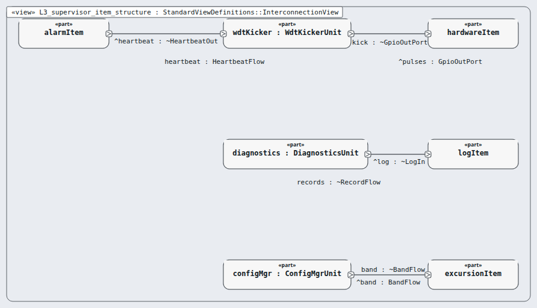

# Level 3 — supervisor-item (software item)

**In one line:** one item per box of the architecture, its own class, and segregation where it is lower than C — this page is the review packet for `supervisor-item`.

| Field | Value |
|---|---|
| Level | 3 of 4 (pinned, IEC 62304) |
| Parent | software-system |
| Children | wdt-kicker, diagnostics, config-mgr |
| IEC 62304 class | C |
| Model | `NodeSupervisorItem.sysml` (satisfies this node's requirements only) |

## Pictures (reading order)

| Picture | Grade | What it shows |
|---|---|---|
|  `L3_supervisor_item_structure` | B | units wdtKicker, diagnostics, configMgr and their one wire each |

## Requirements (3)

| Id | Derived from | Statement |
|---|---|---|
| MRTM-SVI-001 | MRTM-SRS-017 | The supervisor item shall stop the watchdog service pulses within 2 s of a missed alarm heartbeat. |
| MRTM-SVI-002 | MRTM-SRS-018 | The supervisor item shall run the buzzer test within 5 s and the backup alarm test within 15 s of power-up. |
| MRTM-SVI-003 | MRTM-SRS-019 | When the stored band passes its CRC-32 check, and only then, the supervisor item shall set the **Allowed Band** from it. |

DRAFT — needs Masood's review. Generated by tools/pinned-index.py.
