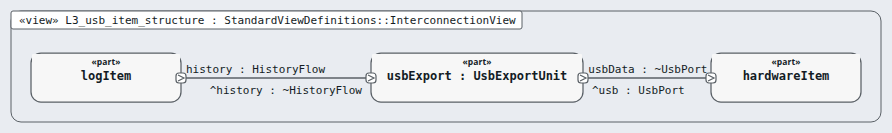

# Level 3 — usb-item (software item)

**In one line:** one item per box of the architecture, its own class, and segregation where it is lower than C — this page is the review packet for `usb-item`.

| Field | Value |
|---|---|
| Level | 3 of 4 (pinned, IEC 62304) |
| Parent | software-system |
| Children | usb-export |
| IEC 62304 class | B |
| Segregation (§5.3.5) | ADR-0034 / A-48: own lowest-priority task on core 0, read-only accessor, owns no data another item reads, task watchdog, CRC-32 per record |
| Model | `NodeUsbItem.sysml` (satisfies this node's requirements only) |

## Pictures (reading order)

| Picture | Grade | What it shows |
|---|---|---|
|  `L3_usb_item_structure` | B | class-B unit usbExport between the log item and the USB connector |

## Requirements (2)

| Id | Derived from | Statement |
|---|---|---|
| MRTM-USI-001 | MRTM-SRS-014 | The USB item shall present the event log as a read-only mass-storage volume within 30 s of connection. |
| MRTM-USI-002 | MRTM-SRS-014 | When the USB host sends a write request, the USB item shall inhibit the write to the **Event Log**. |

DRAFT — needs Masood's review. Generated by tools/pinned-index.py.
