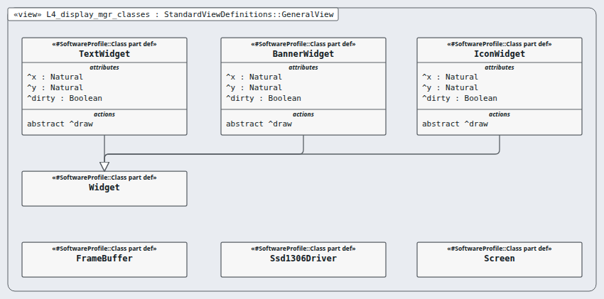

# Level 4 — display-mgr (software unit)

**In one line:** the unit contracts (detailed design), the code and the unit tests — this page is the review packet for `display-mgr`.

| Field | Value |
|---|---|
| Level | 4 of 4 (pinned, IEC 62304) |
| Parent | display-item |
| Children | — (code and tests below) |
| IEC 62304 class | C |
| Code | `10-src/firmware/components/display_mgr/` (contract: `contracts.md`) |
| Model | `NodeDisplayMgr.sysml` (satisfies this node's requirements only) |

## Pictures (reading order)

| Picture | Grade | What it shows |
|---|---|---|
|  `L4_display_mgr_classes` | B | display classes with the software profile's «Class» marker; generalisation drawn |
|  `L4_units_alarm_path_contracts` | D | six unit contracts as named boxes only: the functions (actions) inside an interface def are not drawn (F-5-005) |
|  `L4_units_data_contracts` | D | six unit contracts, names only (F-5-005) |

## Requirements (2)

| Id | Derived from | Statement |
|---|---|---|
| MRTM-DMG-001 | MRTM-DSI-001 | The display manager unit shall draw the excursion warning, probe fault, calibration due and log capacity messages on the first display_mgr_tick after display_mgr_update reports them. |
| MRTM-DMG-002 | MRTM-DSI-002 | The display manager unit shall redraw the temperature digits at most once per 10 s, at 0.1 °C resolution. |

DRAFT — needs Masood's review. Generated by tools/pinned-index.py.
