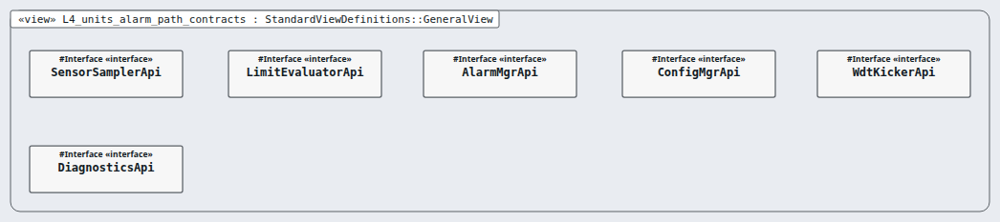
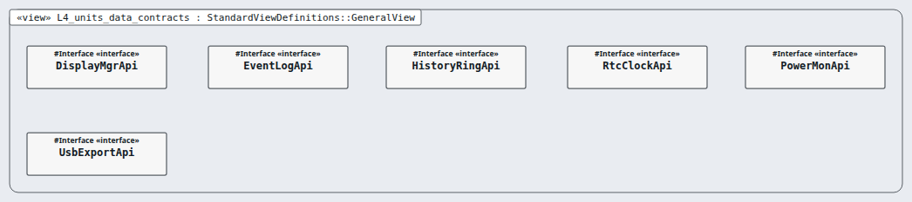

# Level 4 — sensor-sampler (software unit)

**In one line:** the unit contracts (detailed design), the code and the unit tests — this page is the review packet for `sensor-sampler`.

| Field | Value |
|---|---|
| Level | 4 of 4 (pinned, IEC 62304) |
| Parent | sensor-item |
| Children | — (code and tests below) |
| IEC 62304 class | C |
| Code | `10-src/firmware/components/sensor_sampler/` (contract: `contracts.md`) |
| Model | `NodeSensorSampler.sysml` (satisfies this node's requirements only) |

## Pictures (reading order)

| Picture | Grade | What it shows |
|---|---|---|
|  `L4_units_alarm_path_contracts` | D | six unit contracts as named boxes only: the functions (actions) inside an interface def are not drawn (F-5-005) |
|  `L4_units_data_contracts` | D | six unit contracts, names only (F-5-005) |

## Requirements (2)

| Id | Derived from | Statement |
|---|---|---|
| MRTM-SMP-001 | MRTM-SNI-001 | When sensor_sampler_read is called, the sensor sampler unit shall return the sample of the conversion started 750 ms or more before and start the next conversion. |
| MRTM-SMP-002 | MRTM-SNI-002 | The sensor sampler unit shall return a sample marked invalid when the scratchpad CRC-8 differs from byte 8 or the value is outside -30 °C to 50 °C. |

DRAFT — needs Masood's review. Generated by tools/pinned-index.py.
